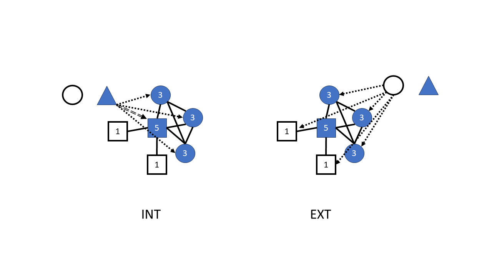

```{r setup, include=FALSE}

source("prelims.R")
r_refs(file="r-references.bib")


my_citations <- cite_r(
  file="r-references.bib"
  , pkgs=c("tidyverse", "igraph", "papaja", "lmerTest")
  , withhold=FALSE
  , footnote=TRUE
)

# load files

regression_data_lyon <- feather::read_feather("Data/regression_data_lyon.feather")
regression_data_providence <- feather::read_feather("Data/regression_data_providence.feather")
regression_data <- rbind(regression_data_lyon, regression_data_providence) %>% 
  group_by(Speaker, age) %>% 
  mutate(INT_z = scale(INT_val),
         EXT_z = scale(EXT_target)) %>% ungroup()

globalthresholds_AOP <- feather::read_feather("Data/globalthresholds_AOP.feather")
full_thresholds <- feather::read_feather("Data/full_thresholds.feather")

comparison_data_P <- read_csv("Data/comparison_data_providence.csv")                                                            
comparison_data_L <- read_csv("Data/comparison_data_lyon.csv")
comparison_data <- rbind(comparison_data_P, comparison_data_L)

globalthresholds_AOP_rand <- read_feather("Data/globalthresholds_AOP_rand.feather") %>% filter(threshold == 0.25 & data_type == "target")

FULLsample <- read_csv("Data/FULLsample.csv")

all_distances <- read_csv("Data/all_distances.csv")

#source("PhonologicalNetworks-Figures.R")
source("PhonologicalNetworks-Tables.R")

stat_sum_df <- function(fun, geom="crossbar", ...) {
  stat_summary(fun.data=fun, colour="red", geom=geom, width=0.2, ...)
}

```

Decades of work on phonological development has documented the systematic nature of infants' earliest words. Studies of phonetic [@mccune_early_2001] and phonological structures [@vihman_prosodic_2016] show that many of a child's first word forms share similar properties. Infants draw on what they know: when articulatory, memory and planning capacities are simultaneously limited, a "phonic core of remembered lexical items and articulations" [@ferguson_words_1975, p.112] may help them deal with the challenge of developing an early lexicon. Vihman [-@vihman_phonological_2019, p.263] describes the early lexicon as "an emergent network of related forms" that develops systematically, in line with the well-rehearsed segments and structures already in the infant's inventory. A networks approach to phonological development offers one way of identifying and quantifying this systematicity. In this study, I present a longitudinal analysis of nine infants' lexical development to identify systematicity in the first three years of word production. I consider the phonological characteristics of the developing lexicon using network analysis to demonstrate how early systematicity may support infants to acquire the requisite capacity for flexible and automatic word production.

In early development, the combined challenges of articulation, memory and planning mean that the constraints on infants' production are high, and so they draw on a limited set of vocal outputs that represent a growing number of target words. According to Vihman [-@vihman_phonological_2014; -@vihman_phonological_2019], word production begins with a small lexicon of phonologically-simple and accurately-produced forms, which are 'selected' for their ease of production, as well as their perceptual salience. As the lexicon grows, target forms that do not necessarily fit these structures are 'adapted' so that they do. Selection of and adaption to accessible phonological structures indicate the presence of systematicity within the developing lexicon. Essentially, the new target form is allocated to one of a small number of accessible or well-rehearsed motoric categories, and as these categories increase in size they become increasingly entrenched [@thelen_esther_dynamic_1996]. In data from their bilingual (English-Spanish) daughter’s early word acquisition, Deuchar and Quay [-@deuchar_bilingual_2000] show that 13 of her first 20 words are produced with a CV structure, and many are phonologically identical: she produces *car*, *clock*, *casa* ‘house’ and *cat* as [ka], and *papa* ‘daddy’, *pájaro* ‘bird’ and *panda* as [pa]. This demonstrates a 'pattern force', whereby production is driven by a small number of well-rehearsed structures. This tendency to acquire similar-sounding forms may continue throughout development: Mitchell, Tsui and Byers-Heinlein [-@mitchell_cognates_2022] show that French-English bilingual infants are more likely to acquire translation equivalents that are similar in phonological form (cognates, e.g. *banana* and *banane*) than non-cognate word pairs (e.g. *dog* and *chien*) upto age 27 months. Systematicity in phonological acquisition may thus support lexical development over the first three years.

One way of interrogating systematicity in early phonological productions is through network analysis, which offers a quantitative perspective on the organization and development of the lexicon. Developmental research in this area centres around the words that children target in production to establish connectivity on phonological [e.g. @siew_investigation_2020] and semantic [e.g. @hills_longitudinal_2009] planes. That is, how similar target words are to one another in form or meaning, and what this might mean for acquisition. However, as yet there is no work looking at the way children *produce* those words; that is, whether or not children are drawing on systematicity in the output. Given the extensive background research that suggests a systematic approach to early word *production*, expanding network analysis to this area is a natural next step for language development networks.

The term *network* refers to a web of forms (or *nodes*, in network terms) that are interconnected based on shared properties. Here these are phonological properties, but could also be semantic, or indeed non-linguistic properties such as genetic information, social connections or location [see @bell_network_2017, for a review]. Network growth models analyse changes within a system over time, and two key models[^1] of development have been proposed for lexical acquisition: preferential attachment (hereafter **INT** due to the assumption that network growth is internally-driven in this model; note that some studies refer to this model as PATT) and preferential acquisition [hereafter **EXT**, due to the assumption that network growth is externally-driven in this model, note that this model is otherwise known as PAQ, @hills_longitudinal_2009; see also @steyvers_large-scale_2005-2]. INT models of network growth propose a rich-get-richer scenario, whereby the most highly-connected nodes (nodes with more *edges*) in the network are most likely to attract new nodes. In phonological development terms, this model implies that the lexicon will constitute clusters of similar-sounding words (i.e. denser phonological neighbourhoods), and that a child is more likely to acquire new words that attach to these dense clusters: infants' production of newly-acquired words will be similar to their production of existing words in the lexicon. INT-like growth is therefore driven by the *internal* linguistic system. On the other hand, EXT-like growth assumes that forms that connect to (i.e. share properties with) a higher number of *different* nodes in the target network will be acquired first. EXT models of network growth thus assume that *external* factors in the learning environment influence acquisition -- that is, forms that are most well-connected within the target language will be acquired earlier. In phonological terms, this would mean that early productions would constitute the distribution of segments and structures that co-occur most frequently in the input, thus leading early forms to resemble the statistical properties of the ambient language more closely, rather than a 'pattern force' driven by dominant features of the existing lexicon. For example, given an existing lexicon that included the forms *pat* and *bat*, an INT model would predict that a highly phonologically-similar form such as *pit* or *bit* might be acquired next, whereas EXT would predict that more variable forms would be acquired, such as /p/-initial or /t/-final words, which have high phonotactic probability in English and thus connect to a wider range of different forms.

Existing studies show mixed evidence for INT- and EXT-like growth[^2] in lexical development. Hills and colleagues' [-@hills_longitudinal_2009] study of semantic networks showed evidence for EXT, but not INT, in associative networks of normed vocabulary acquisition data. Amatuni and Bergelson [-@amatuni_semantic_2017] support this with an analysis of a large-scale corpus of input data combined with normed productive vocabulary data derived from WordBank [@frank_wordbank_2017]. These same approaches have also been applied to phonological data: Fourtassi, Bian and Frank [-@fourtassi_growth_2020] analyse both phonological and semantic network growth from vocabulary norms (receptive and productive) in 10 languages to find consistent evidence in support of EXT-like growth, for both phonological and semantic networks, receptive and productive vocabularies, and across the 10 languages included in their analysis. Ciaglia, Stella and Kennington [-@ciaglia_investigating_2023] analysed complex multiplex networks (including phonological, semantic, sensorimotor and visual associations) to find evidence for both EXT and INT in word learning, though evidence was stronger for EXT. In contrast, Siew and Vitevitch [-@siew_investigation_2020] tested phonological networks in acquisition of older Dutch- and English-learning children (age 3-9 years), again using vocabulary norms to indicate age of acquisition for each word. Their analysis revealed contrasting findings for English compared with Dutch, as well as an age effect: INT-like network growth predicted acquisition in English and Dutch, and both EXT and a third model (Lure of the Associates, see note above) predicted word learning in Dutch. INT was a better predictor of acquisition earlier on in development (i.e. earlier-acquired words were likely to attach to densely-connected clusters of similar forms); later on, the opposite was found, whereby later-acquired words tended to be phonologically more distinct (i.e. less similar to existing words in the network). A replication of this study using data from adult second-language learners of English found consistent results [@luef_growth_2022]. Evidence in favour of INT has also been found in adult word-learning experiments: for example, Mak and Twitchell's [-@mak_evidence_2020] work with paired-association learning in adults shows that participants were better at remembering word pairs when items had been paired with cue words in semantic space that had a higher degree (i.e. were connected to a larger number of semantically-similar words). The authors propose that these highly-connected words may support learning due to the fact that they tend to be used more flexibly, and thus occur in a more diverse set of linguistic contexts. In infancy, this relates back to Ferguson and Farwell's "phonic core of remembered lexical items and articulations" [-@ferguson_words_1975, p.112], as infants apply the same well-rehearsed phonological form flexibly and systematically to new items in the lexicon.

These studies present an intersection of evidence for the role of INT and EXT network growth in phonological development. However, two key aspects of these existing approaches should be expanded further. First, the consideration of acquisition in terms of only target forms provides no view of systematicity in *production*, which is where systematicity has been most well-documented in naturalistic data. Second, vocabulary norming data abstracts away from the individual differences expected in early phonological development [e.g. @vihman_external_1994]; by drawing on data that generalises across hundreds (or even thousands) of children, it may not be possible to capture developing systematicity due to individual differences in the words and sounds that are acquired first. This makes it difficult to test which model of network growth (INT or EXT) is most cogent. To better understand the role of systematicity in early word production, it is essential to consider infants' *actual productions* of their early word forms, in terms of both *how* and *when* they produce them. In this paper, I analyse phonological networks of both *target* and *actual forms* (that is, the words children produce, and the way they produce them) produced in naturalistic data from two languages, in order to consider phonological systematicity within the individual development trajectories of nine infants.

# Hypotheses

Drawing on naturalistic data, this study uses network growth models to capture phonological connectivity (taken here as an index of systematicity) within the individual lexicons of nine infants. Two  sets of networks will be established for each infant: one tracing connections between infants' *actual* word productions, the other between the *target* productions of these forms. Network analysis will quantify systematicity in the developing lexicon via two key network growth frameworks: INT and EXT. I will draw on approaches outlined in previous studies [@amatuni_semantic_2017; @fourtassi_growth_2020; @siew_investigation_2020] to test whether naturalistic data reveals evidence of systematicity in infants' output forms, such that language development is shaped by existing production knowledge. Specifically, I predict that:

H1) Developing phonological networks will show stronger evidence of an INT-like model of growth over an EXT-like model, based on evidence from the phonological development literature that shows phonological similarity across individual infants' lexicons [e.g. @vihman_emergence_2013].

H2) INT-like growth will be most evident earlier on in development, as infants select and then adapt words to fit their production capacity [@vihman_phonological_2019]. Later, more variability is expected as phonological capacity develops. This would also align with previous evidence for INT-like growth in toddlers [@siew_investigation_2020] and novel word learning in adults [@mak_evidence_2020].

H3) If INT-like growth is supported in the data, then this should be more convincing for Actual than Target productions, given that we expect infants to adapt target words to fit the motor routines that are most accessible to them in production. This difference is not expected for an EXT-like model of network growth, which assumes that network growth reflects connectivity in the input; the question of differences between Actual and Target forms is thus not of central theoretical interest for EXT models in this analysis.

To test these hypotheses, phonological networks will be established for nine infants acquiring American English or French. Phonological distance will be calculated between each word and each other word in each infant's network to establish connectivity within the network. Logistic regression models and Generalized Additive Mixed Models (GAMMs) will determine whether acquisition of *Actual* and *Target* forms reflects INT- or EXT-like growth in early phonological development, and how these networks change over time.


# Methods

This analysis follows approaches taken by Hills and colleagues [-@hills_longitudinal_2009] and Siew and Vitevitch [-@siew_investigation_2020], by establishing network growth values for each word in each child's lexicon. Logistic regression models will be used to test whether INT or EXT growth values can best predict word learning. This is followed with the use of Generalized Additive Mixed Models (GAMMs) to analyse the trajectory of network growth values over time.

## Data and Materials

Data for this study was extracted from CHILDES [Child Language Data Exchange System, @macwhinney_childes_2000] using Phon [@hedlund_gregory_phon_2020]. Two corpora were selected for the analysis: American English [Providence corpus, @demuth_word-minimality_2006] and French [Lyon corpus, @demuth_katherine_prosodically-conditioned_2008]. These corpora were selected due to their parallel data collection and transcription methods. The English data includes five infants (including two boys[^3]) and four from the French corpus (two boys). Both corpora include spontaneous[^4] interactions between child and caregiver, recorded in the home for one hour every two weeks from the onset of first words. The original corpora were orthographically transcribed, and then phonetically transcribed and checked by trained coders. See Demuth et al. [-@demuth_word-minimality_2006] and Demuth and Tremblay [-@demuth_katherine_prosodically-conditioned_2008] for full details of data collection and annotation.

Transcripts were extracted from the first session in the dataset (the first session in which the child produced a word) until age 2;6. Data was analysed on a month-by-month basis, such that all new word types produced in each month were aggregated to give a rolling monthly network of all words produced by each child. The session in which a word first occurred was considered the session in which it was 'acquired', and was included in that month's list of newly-acquired words. Later productions of the same word were not included in the dataset. Two of the American infants (Naima and Lily) had denser data taken at weekly intervals during some periods of data collection, but this is not considered to be an issue as no between-child comparisons will be conducted, and subject will be coded as a random effect in all statistical models. The total network of words at any given month amounts to all the unique words produced up to and including that month. All tokens of each newly-acquired word produced by each infant in each session were extracted (*Actual* forms, i.e., the phonological form as produced by the child) alongside their target transcription (*Target* forms).

```{r data overview}
types.corpus <- regression_data %>%
  group_by(corpus, Speaker) %>%
  distinct(gloss1, .keep_all=T) %>%
  tally() %>% summarise(n=sum(n))

types <- regression_data %>%
  group_by(Speaker) %>%
  distinct(gloss1, .keep_all=T) %>%
  tally() %>% summarise(n=sum(n))

tokens <- regression_data %>%
  summarise(mean_tok=mean(n_tokens, na.rm=T),
            sd_tok = sd(n_tokens, na.rm=T))

syls <- comparison_data %>%
  distinct(Gloss, Speaker, .keep_all = T) %>%
  group_by(corpus) %>%
  summarise(mean_syl = mean(nsyl_target),
              sd_syl = sd(nsyl_target),
              max_syl = max(nsyl_target))

nsyls <- comparison_data %>%
    distinct(Gloss, Speaker, .keep_all = T) %>%
  group_by(corpus, nsyl_target) %>%
  tally() %>%
  pivot_wider(names_from = corpus, values_from = n)

syl.4 <- subset(nsyls, nsyl_target == 4)$French
```

Only words included on the US English and French communicative development inventories [CDIs, @fenson_variability_1994; @kern_sophie_ifdc_2010] were analysed. Following Jones and Brandt [-@jones_children_2019], every unique word was considered, though plurals were categorised with their singular nouns. For example, *fall*, *fell* and *falling* were considered as unique words (coded under the CDI 'basic level' *fall*), while *bananas* was categorised with its singular form *banana* and *children* with *child*. In the French data, this rule was also applied to masculine/feminine forms: *animaux* was categorised with the singular *animal*, and feminine *petite* was categorised with masculine *petit*. Words with the same basic level form that were orthographically different but phonologically indistinguishable (e.g. verb forms in French, such as *aime* and *aiment* from the infinitive *aimer* 'to love') were categorised together. This approach was taken in order to account for developmental changes in infants' word production (i.e. the production of more complex morphological forms) while also avoiding coding two words as different that share almost identical forms and meanings (e.g. plural nouns).
To generate networks of Actual and Target forms, phonological distance was calculated between every word and every other word in the cumulative network at each month, following Monaghan, Christiansen, Farmer and Fitneva's [-@monaghan_measures_2010] approach. This is based on phonological features, following Harm and Seidenberg [-@seidenberg_dyslexia_1999] and based on Chomsky and Halle's [-@chomsky_noam_sound_1968] theory of government phonology. This was considered to be the most appropriate measure of phonological distance, as oppose to other established measures such as Levenshtein distance in phonemes [e.g. @fourtassi_growth_2020; @siew_investigation_2020]: distinctive features allow us to consider distance on a phonologically-appropriate gradient, whereby the difference between words such as *bat* and *pat* is smaller than the difference between *bat* and *rat*. Using edit distance (in phonemes) as a measure, *pat*, *bat* and *rat* would be equidistant, thereby equating all phonemes as articulatorily similar, which does not reflect the reality of phonological development: /p/ and /b/ are among the earliest consonants to be acquired, whereas /r/ is not typically acquired until around age 5 [cf. @mcleod_childrens_2018]. Note that in the present analysis only consonants were included, given that vowels are highly variable in production until around age 3, and notoriously difficult to transcribe from child speech [@donegan_normal_2013; @kent_what_2020]. This means that two words that differ only in their vowel segments are coded as the same in the current analysis. Words were aligned by syllable nucleus: onset consonants were compared with other onset consonants, and codas were compared with codas. Full criteria for establishing distance, alongside tabulated examples, are included in the Supplementary Information, S1. When multiple tokens of the same word type were produced in a single session, the values derived from the distinctive feature matrix were averaged across tokens to create a mean phonological representation for each word type. While this is not a perfect measure, it captures a metric of both variability and similarity within and between each word type.

```{r CDI words, include=FALSE}

all_words_L <- read_csv("Data/FULLsample_Lyon_all.csv") %>%
   mutate(inCDI = ifelse(is.na(gloss1), F, T)) %>%
   group_by(Speaker, Gloss, inCDI) %>% tally()
all_words_P <- read_csv("Data/FULLsample_Providence_all.csv") %>%
   mutate(inCDI = ifelse(is.na(inCDI), F, inCDI)) %>%
   group_by(Speaker, Gloss, inCDI) %>% tally()

all_words <- rbind(all_words_L, all_words_P)

single_tokens <- FULLsample %>% group_by(Speaker, Gloss) %>% tally() %>% filter(n==1)
multi_tokens <- FULLsample %>% group_by(Speaker, Gloss, Age, corpus) %>% tally() %>% ungroup() %>% group_by(Speaker, Gloss, corpus) %>% tally()

```

Altogether, `r (nrow(all_words) - nrow(subset(all_words, inCDI==T)))` words were excluded from the data due to not appearing on the French or American English CDIs (`r (nrow(all_words_L) - nrow(subset(all_words_L, inCDI==T)))` in French and `r (nrow(all_words_P) - nrow(subset(all_words_P, inCDI==T)))` in English). The final dataset includes `r round(types$n)` word types overall, aggregated across infants (English=`r round(subset(types.corpus, corpus == "English")$n)`, French=`r round(subset(types.corpus, corpus == "French")$n)`). On average, there were `r round(tokens$mean_tok)` tokens of each word type (SD = `r round(tokens$sd_tok)`); `r length(single_tokens)` words occurred only once in the data, and on average each word type was produced across `r round(mean(multi_tokens$n,0))` different months (SD = `r round(sd(multi_tokens$n,0))`), which supports the (admittedly imperfect) assumption made here that the first production of a word in the dataset indicates its acquisition in the infant's lexicon. See Table \@ref(tab:table-data-overview) for a breakdown of the data by corpus and child.  All but `r syl.4` tokens (all French) in the data had three syllables or fewer in the target form, with `r round(subset(syls, corpus == "English")$mean_syl)` syllable on average in the English data (SD = `r round(subset(syls, corpus == "English")$sd_syl,2)`) and `r round(subset(syls, corpus == "French")$mean_syl,2)` in the French data (SD = `r round(subset(syls, corpus == "French")$sd_syl,2)`).

```{r table-data-overview, echo=F, message=FALSE, warning=FALSE, comment=F}
cap="Age (months) at first session, number of sessions and number of distinct word types and tokens produced by each child in the dataset. Means and SDs for each corpus are shown in bold."
#apa_table(table.data.overview, caption=cap, col_spanners=NULL, digits=0, placement="H", font_size="small")
kable(table.data.overview, "latex", booktabs=T, longtable=T,
      caption=cap, digits=0, align="c")  %>%
  kable_styling()%>%
  row_spec(4, bold=F, hline_after=T) %>%
  row_spec(5, bold=T, hline_after=F) %>%
  row_spec(6, bold=T, hline_after=T) %>%
  row_spec(11, bold=F,hline_after=T) %>%
  row_spec(12, bold=T,hline_after=F) %>%
  row_spec(13, bold=T,hline_after=T) %>%
  row_spec(14, bold=T,hline_after=F) %>%
  row_spec(15, bold=T,hline_after=F)
```

## Network Analysis
For each child, two kinds of network were generated: 1) a *global network*, which represents the final network, i.e. all words produced in the data by 2;6. This network includes the Target production of all individual word types produced in the dataset, coded for age of first production. The global network is taken to reflect the learning environment, or the input, which is why only Target forms are included; this will be used to establish EXT growth values for each word in the data (see below), and also serves as a proxy for the 'end-state' towards which each child's phonological development is directed. 2) A series of 'known' networks representing the lexicon at each month. Each monthly known network includes all the words produced up to and including the given month, in either Actual (the infants' realization) or Target (the target realization) form. This series of networks is used to generate INT values for each word in the data. As a reminder, for both kinds of networks, a given word type was included from the first session in which it occurred, and multiple tokens of a given word type in that session were 'averaged out' to one unique set of distinctive feature values for each word, from which connectivity with all other word types was then derived. Connectivity was established between all words in the global network, and all words in each monthly network; two nodes were considered to be connected (i.e., formed an edge) if they had a scaled phonological distance of 0.25 or less; this value was established by standardizing all phonological distance values for each infant, and then selecting the the value that captured the first quartile of connectivity within the dataset. The first quartile of connectivity across individual corpora (English and French) and data types (Actual and Target) ranged from  a scaled distance of`r min(subset(all_distances, corpus != "all")$Q1)` to `r max(subset(all_distances, corpus != "all")$Q1)` (see S2 and S3 for further details); the threshold of 0.25 thus represents the upper limit of the total variability across the four subsets of data. All edges in the networks were unweighted and undirected.

```{r network comparison, include=FALSE}

ntargetactual <- globalthresholds_AOP %>% group_by(data_type) %>% tally()
network_diff_A <- nrow(subset(full_thresholds, data_type == "actual")) - nrow(subset(globalthresholds_AOP, data_type == "actual"))
network_diff_T <- nrow(subset(full_thresholds, data_type == "target")) - nrow(subset(globalthresholds_AOP, data_type == "target"))

```


```{r INT-EXT-vis, echo=FALSE, fig.cap = cap}

cap = "Visualisation of INT and EXT models of network growth. Shapes represent nodes in the network and filled lines represent edges between nodes. Numbers show the degree of each existing node in the network. The two images demonstrate the likelihood of two new nodes - a filled triangle or an open circle - being added to the network under conditions of INT- and EXT-like network growth. In each case, the node that would be acquired is added to the network, and new edges are shown with dashed arrows. The double-dashed arrow in the INT model shows the new edge formed with the most highly-connected node in the existing network."


```


Once networks were established, INT and EXT values were calculated for each word. Following Siew and Vitevitch's [-@siew_investigation_2020] approach, these values were generated by computing, for each month, the likelihood that an as-yet-unknown word (i.e. all the words in the global network - that is, all words produced in a given child's data up to and including age 2;6 - that had not yet been produced) would form an edge with known words in the existing network (i.e. the words produced up to and including a given month). The INT value of a given yet-to-be-learned word represents the median degree of all the words it would connect to (i.e. those with a phonological distance of 0.25 or less) if it were learned in the following month. For example, a word with an INT value of 5.6 would connect to a set of words in the following month that, on average, connected to 5.6 other words each. Given that INT assumes that newly-acquired words will connect to already-well-connected words in the existing network, higher INT values predict learning in the following month: new words will connect to words with higher median degrees. INT networks were generated with both Actual and Target forms. EXT values reflect the degree of a given word in the global network of all words produced by 2;6. So a word with an EXT value of 87 connects to 87 other words in the global network. See Figure \@ref(fig:INT-EXT-vis) for a visualization of these two models of acquisition. Again, as EXT predicts that well-connected words in the global network would be acquired earlier, higher EXT values predict earlier learning; in each month, we would expect that as-yet-unknown words with the highest EXT values will be acquired in the following month. As EXT-like growth is assumed to represent the connectivity of words in the ambient language, global networks were established with Target forms only, since the way infants produce words in the existing network is not relevant to this model. However, given that connectivity differs across Target and Actual networks (i.e., the known words in the Actual network at month *n* may be different from the known words in the Target network in the same month), both Actual and Target network structure will be tested in the analysis. To clarify, as both INT and EXT values are established through connectivity in the network (i.e. only words that form an edge with another word are represented), the words included in each network differs slightly; `r (network_diff_A)` words did not connect to any other word at a threshold of 0.25 in the Actual data, and `r (network_diff_T)` words in the Target data. For the same reason, the size of Actual (n = `r (subset(ntargetactual, data_type == "actual")$n)`) and Target (n = `r (subset(ntargetactual, data_type == "target")$n)`) networks differs, as some forms connected at a threshold of 0.25 in their Actual, but not their Target, forms.

## Data Analysis

### Network growth models
Network growth models will be used to address the first two hypotheses. Network growth models are logistic regression models that predict whether or not a word is learned in the following month; the dependent variable is whether or not a word was learned in month *n*+1 (learned vs. not learned). The key predictors of acquisition are INT/EXT growth values for each word at each month. The models test the assumption that higher growth values predict earlier learning, such that words with higher INT/EXT values at month *n* are more likely to be learned at month *n*+1. Following predictions set out in H1, model comparisons should show INT values to be a better predictor of word learning than EXT values. H2 predicts age-related changes in the effect of INT; an INT x Age interaction is expected to show INT to be a better predictor of learning at earlier time-points.

### GAMMs
It is also a possibility that any age-related changes will be non-linear. To address this, Generalized Additive Mixed Models (GAMMs) will be used to test H2, following Wieling [-@wieling_analyzing_2018] and Sóskuthy [-@soskuthy_generalised_2017]. GAMMs allow analysis of dynamically varying data (i.e. change over time), without assuming change to be linear. Since there is no clear expectation as to whether any age-related changes would be linear or not, testing H2 using both logistic regression and GAMMs will account for both possibilities. Non-linearity in the data is analysed in the model through the inclusion of *smooth terms* and *random smooths*, which capture the non-linearity of fixed and random effects, respectively, alongside parametric terms. The dependent variable in these models will be INT and EXT values (tested as predictors in the network growth models outlined above); if predictions set out in H2 are borne out in the data, then we would expect to see a significant effect for age on INT/EXT values as a smooth in the model. H3 will also be tested using GAMMs, given that any differences between Actual and Target data may change over time. Here, we would expect to see a significant effect for Data type as a parametric term. These effects will be identified through nested model comparison and inspection of smooth plots. Full model details are provided below.

All code for data preparation and analysis can be found on the project’s OSF page at https://osf.io/uzrsy/ [@laing_phonological_2024]. This study was not pre-registered.

## Results

### Age of production (AoP) ~ connectivity

```{r aop-degree correlations, message=FALSE, warning=FALSE, include=FALSE}

stats.corr.all <- table.aop.deg.corr.speaker %>% summarise(mean_rho=mean(rho),
                                                      sd_rho=sd(rho))

stats.corr_Providence <- globalthresholds_AOP %>%
        group_by(Speaker, corpus, data_type) %>%
        summarize(rho=stats::cor.test(AOP, degree, method="sp")$estimate,
                  pval=stats::cor.test(AOP, degree, method="sp")$p.value
                  ) %>%
        ungroup() %>% group_by(corpus) %>%
  summarise(mean_rho=mean(rho),
            sd_rho=sd(rho)) %>%
  filter(corpus == "English")

stats.corr_Lyon <- globalthresholds_AOP %>%
        group_by(Speaker, corpus, data_type) %>%
        summarize(rho=stats::cor.test(AOP, degree, method="sp")$estimate,
                  pval=stats::cor.test(AOP, degree, method="sp")$p.value
                  ) %>%
        ungroup() %>% group_by(corpus) %>%
  summarise(mean_rho=mean(rho),
            sd_rho=sd(rho)) %>%
  filter(corpus == "French")

stats.corr.rand <- globalthresholds_AOP_rand %>%
        summarize(rho=stats::cor.test(AOP, degree, method="sp")$estimate,
                  pval=stats::cor.test(AOP, degree, method="sp")$p.value
                  ) %>%
        ungroup()

```

First, to assess the broader assumption that connectivity in the network will change systematically over time, regardless of whether that is through INT- or EXT-like changes, the relationship between age of production (AoP) and connectivity (degree) in the static network was considered. Both INT and EXT models of network growth assume that later-acquired words will be less well-connected in the network. Across all infants, there was a mean AoP~degree correlation of *r*=`r round(stats.corr.all$mean_rho,3)` (Spearman's, *SD*=`r printnum(stats.corr.all$sd_rho)`; English: *r*=`r round(stats.corr_Providence$mean_rho,3)`, *SD* =`r printnum(stats.corr_Providence$sd_rho)`; French: *r*=`r round(stats.corr_Lyon$mean_rho,3)`, *SD*=`r printnum(stats.corr_Lyon$sd_rho)`); overall, later-learned words were less well-connected in the networks. Negative correlations were found in all children's data except Anais, and these were all significant at *p*<.05 except Anais and Nathan (French corpus). See S3. This is consistent with previous similar work showing that earlier-learned words are more highly-connected in the network [@fourtassi_growth_2020; @hills_longitudinal_2009], and replicates these findings with a naturalistic sample of infant production data. To ascertain that this negative relationship between AoP and connectivity is not simply a given in vocabulary-based networks that increase in size over time, this analysis was re-run on an identical dataset that was randomized by AoP, such that new words were added to the French and English networks at random ages, and then the degree of each word in this random network was calculated. Across the data, there was no correlation between AoP and degree (*r*=`r printnum(stats.corr.rand$rho)`; *p*=`r printp(stats.corr.rand$pval)`); evidence for INT/EXT-like growth in the real data is thus not an inevitable outcome of vocabulary growth.

### Network growth models

```{r regression data prep}

aoa_na <- regression_data %>% filter(age == (AOP-1) & is.na(aoa_comp) & data_type == "target")

aoa_na_types <- aoa_na %>% distinct(gloss1) %>% tally()

```

Next, network growth models were generated to test whether INT and EXT values predicted which words were produced in the following month. As a reminder, models of both INT- and EXT-like acquisition predict that, for each month, the as-yet-unknown words with the highest INT/EXT values should be learned in the following month.
Logistic mixed effects regression models included a binomial dependent variable (coded as 0 or 1) indexing whether, for each as-yet-unknown word at month *n*, it was acquired in month *n+1*. As well as INT and EXT growth values, each model also included target word length in phonemes, reported age of acquisition for each item in the comprehensive vocabulary according to vocabulary checklists (CDIs; see below), input frequency in child-directed speech, word category (based on CDI word categories), and corpus (English vs. French) as fixed effects. Infant was specified as a random effect with a by-infant random slope for the effect of age. Input frequency for each word was derived from Braginsky et al.'s [-@braginsky_consistency_2019] frequency estimates, which includes a unigram count for every word produced in adult speech in all CHILDES corpora for the respective language. Normed comprehensive vocabulary data for English and French CDI words was taken from WordBank [@frank_wordbank_2017]; again following Braginsky and colleagues [-@braginsky_consistency_2019], age of acquisition (AoA) was taken as the month in which >50% of children were reported to understand a given word. As comprehensive vocabulary norms are only available up to ages 16/18 months for French/US English data, respectively, in total `r nrow(aoa_na)` tokens did not include this measure (`r aoa_na_types` word types across all infants), either due to the word being acquired after the cut-off age for the CDI checklist (i.e. it was included on the checklist but fewer than 50% of infants understood the word by 16/18 months), or due to it not being included on the checklist in the first place (i.e. it is included on the productive vocabulary checklist only). All relevant variables were scaled and centered; INT/EXT values were scaled by speaker and age to account for the effect that increased vocabulary size at each month has on INT/EXT values (i.e. when the network is bigger, a newly-acquired word has the opportunity to connect to a higher number of different words by default). In each case interactions were included between Word length x Age, Word frequency x Age, AoA x Age and INT/EXT values x Age.  P-values were established through nested model comparisons. Analysis of Actual/Target data includes INT values for the Actual/Target network, respectively. EXT values always represent connectivity in the Target network (i.e. to simulate the adult production of a given word in the input), but models were run on both Actual and Target data since connectivity in these data sets differed due to words generally being more highly connected at a threshold of 0.25 in the Actual data than the Target data, as explained above. These models were run using the *lme4()* package [@R-lme4] in R [@R-base].

Following Siew and Vitevitch [-@siew_investigation_2020], the first step was to construct three models: a null model (model 0) with word length, input frequency, comprehensive AoA, word category, corpus, and age included as predictors of word learning, and then two additional models with INT (model 1) and EXT (model 2) growth values included as additional predictors, respectively. Models 1 and 2 were then compared against model 0 to test for the effects of INT and EXT values individually. A third model (model 3) was then constructed that included both INT and EXT values as predictors. Data type (Actual and Target) was modeled separately in each case. The full model specification for model 3 is as follows:

*Model 3*: Learned next ~
                EXT value * Age +
                INT value * Age +
                Word length * Age +
                Input frequency * Age +
                AoA (comprehension) * Age +
                Category +
                Corpus +
                (1 + Age|Speaker)

```{r regression model actual, message=FALSE, warning=FALSE, include=FALSE}

reg_dat <- regression_data[which(complete.cases(regression_data[,c('EXT_scaled_target',
                                                                   'INT_scaled',
                                                                   'INT_z',
                                                                   'EXT_z',
                                                                   'length_scaled',
                                                                   'freq_scaled',
                                                                   'aoa_scaled',
                                                                   'age_scaled',
                                                                   'tokens_scaled',
                                                                   'corpus',
                                                                   'AOP',
                                                                   'category')])),]

# check for multicollinearity with all potential variables included in the null model:

# model_null <- glmer(learned_next ~
#                     age_scaled +
#                     length_scaled +
#                     #tokens_scaled +
#                     freq_scaled +
#                     #vocab_scaled +
#                     aoa_scaled +
#                     corpus +
#                     #category +
#                     (1+age_scaled|Speaker),
#                     family=binomial("logit"),
#                     control=glmerControl(calc.derivs=FALSE,
#                                          optimizer="bobyqa",
#                                            # specifiying optimizer to support convergence
#                                            #(does not converge without this)
#                                          optCtrl=list(maxfun=2e5)),
#                     data=subset(reg_dat, data_type == "actual"))
#
# model_added <- glmer(learned_next ~
#                       age_scaled +
#                     length_scaled +
#                     #tokens_scaled +
#                     freq_scaled +
#                     #vocab_scaled +
#                     aoa_scaled +
#                     corpus +
#                     category +
#                     (1+age_scaled|Speaker),
#                     family=binomial("logit"),
#                     control=glmerControl(calc.derivs=FALSE,
#                                          optimizer="bobyqa",
#                                            # specifiying optimizer to support convergence
#                                            #(does not converge without this)
#                                          optCtrl=list(maxfun=2e5)),
#                     data=subset(reg_dat, data_type == "actual"))
#
# anova(model_null, model_added)
#
# vif(model_added)


model0_A <- glmer(learned_next ~
                    length_scaled*age_scaled +
                    freq_scaled*age_scaled +
                    aoa_scaled*age_scaled +
                    corpus +
                    category +
                    (1+age_scaled|Speaker),
                    family=binomial("logit"),
                    control=glmerControl(calc.derivs=FALSE,
                                         optimizer="bobyqa",
                                           # specifiying optimizer to support convergence
                                           #(does not converge without this)
                                         optCtrl=list(maxfun=2e5)),
                    data=subset(reg_dat, data_type == "actual"))

# summary(model0_A)

model1_A <- glmer(learned_next ~
                    INT_z*age_scaled +
                    length_scaled*age_scaled +
                    freq_scaled*age_scaled +
                    aoa_scaled*age_scaled +
                    corpus +
                    category +
                    (1+age_scaled|Speaker),
                    family=binomial("logit"),
                    control=glmerControl(calc.derivs=FALSE,
                                         optimizer="bobyqa",
                                         optCtrl=list(maxfun=2e5)),
                    data=subset(reg_dat, data_type == "actual"))


models01_A <- anova(model0_A, model1_A)

model2_A <- glmer(learned_next ~
                    EXT_z*age_scaled +
                    length_scaled*age_scaled +
                    freq_scaled*age_scaled +
                    aoa_scaled*age_scaled +
                    corpus +
                    category +
                    (1+age_scaled|Speaker),
                    family=binomial("logit"),
                    control=glmerControl(calc.derivs=FALSE,
                                         optimizer="bobyqa",
                                         optCtrl=list(maxfun=2e5)),
                    data=subset(reg_dat, data_type == "actual"))

models02_A <- anova(model0_A, model2_A)

model3_A <- glmer(learned_next ~
                    INT_z*age_scaled +
                    EXT_z*age_scaled +
                    length_scaled*age_scaled +
                    freq_scaled*age_scaled +
                    aoa_scaled*age_scaled +
                    corpus +
                    category +
                    (1+age_scaled|Speaker),
                    family=binomial("logit"),
                    control=glmerControl(calc.derivs=FALSE,
                                         optimizer="bobyqa",
                                         optCtrl=list(maxfun=2e5)),
                    data=subset(reg_dat, data_type == "actual"))

models13_A <- anova(model1_A, model3_A)
models23_A <- anova(model2_A, model3_A)

confint.model3_A <- tidy(model3_A,effects="fixed",conf.int=TRUE) %>%
  select(term, conf.low, conf.high) %>%
  mutate(across(where(is.numeric), round, 2)) %>%
  unite(`95% CI`, c(conf.low, conf.high), sep = ",",)

confint.model3_A$`95% CI` <- paste0("[", confint.model3_A$`95% CI`, "]")

#summary(model3_A)

table.A.model.output <- rbind(models01_A, models02_A, models13_A, models23_A) %>%
  rownames_to_column(var="Model") %>%
  filter(Chisq > 0) %>%
  rename("p"=`Pr(>Chisq)`) %>%
  mutate(Model=fct_recode(Model,
                           "null vs. INT"="model1_A",
                            "null vs. EXT"="model2_A",
                            "INT vs. INT+EXT"="model3_A",
                            "EXT vs. INT+EXT"="model3_A1"),
             p=scales::pvalue(p)
        ) %>%
  select(Model, `Df`, `Chisq`, `p`)

model.summary_A <- summary(model3_A)

model3_A_tab <- model.summary_A$coefficients %>%
  as.data.frame %>%
  rename(
    "b"="Estimate"
     , "SE"="Std. Error"
     , "z"="z value"
     , "p"="Pr(>|z|)") %>%
  mutate(
    Effect=papaja:::beautify_terms(rownames(.))
  )

table.model3_A <- model3_A_tab %>%
  printnum(
    digits=c(2, 2, 2, 3)
    , gt1=c(TRUE, TRUE, TRUE, TRUE)
    , zero=c(TRUE, TRUE, TRUE, TRUE)
  ) %>%
  rownames_to_column(var = "term") %>%
  left_join(confint.model3_A) %>%
  select(Effect, `b`, `SE`, `z`, `p`, `95% CI`) %>%
  rename("beta"=`b`) %>%
  mutate(beta=as.numeric(beta),
        SE=as.numeric(SE),
        `z`=as.numeric(`z`),
        `p`=as.numeric(`p`),
             p=scales::pvalue(p))
```

```{r regression model Target, message=FALSE, warning=FALSE, include=FALSE}

model0_T <- glmer(learned_next ~
                    length_scaled*age_scaled +
                    freq_scaled*age_scaled +
                    aoa_scaled*age_scaled +
                    corpus +
                    category +
                    (1+age_scaled|Speaker),
                    family=binomial("logit"),
                    control=glmerControl(calc.derivs=FALSE,
                                         optimizer="bobyqa",
                                         optCtrl=list(maxfun=2e5)),
                    data=subset(reg_dat, data_type == "target"))

model1_T <- glmer(learned_next ~
                    INT_z*age_scaled +
                    length_scaled*age_scaled +
                    freq_scaled*age_scaled +
                    aoa_scaled*age_scaled +
                    corpus +
                    category +
                    (1+age_scaled|Speaker),
                    family=binomial("logit"),
                    control=glmerControl(calc.derivs=FALSE,
                                         optimizer="bobyqa",
                                         optCtrl=list(maxfun=2e5)),
                    data=subset(reg_dat, data_type == "target"))


models01_T <- anova(model0_T, model1_T)

model2_T <- glmer(learned_next ~
                    EXT_z*age_scaled +
                    length_scaled*age_scaled +
                    freq_scaled*age_scaled +
                    aoa_scaled*age_scaled +
                    corpus +
                    category +
                    (1+age_scaled|Speaker),
                    family=binomial("logit"),
                    control=glmerControl(calc.derivs=FALSE,
                                         optimizer="bobyqa",
                                         optCtrl=list(maxfun=2e5)),
                    data=subset(reg_dat, data_type == "target"))

models02_T <- anova(model0_T, model2_T)

model3_T <- glmer(learned_next ~
                    INT_z*age_scaled +
                    EXT_z*age_scaled +
                    length_scaled*age_scaled +
                    freq_scaled*age_scaled +
                    aoa_scaled*age_scaled +
                    corpus +
                    category +
                    (1+age_scaled|Speaker),
                    family=binomial("logit"),
                    control=glmerControl(calc.derivs=FALSE,
                                         optimizer="bobyqa",
                                         optCtrl=list(maxfun=2e5)),
                    data=subset(reg_dat, data_type == "target"))

models13_T <- anova(model1_T, model3_T)
models23_T <- anova(model2_T, model3_T)

confint.model3_T <- tidy(model3_T,effects="fixed",conf.int=TRUE) %>%
  select(term, conf.low, conf.high) %>%
  mutate(across(where(is.numeric), round, 2)) %>%
  unite(`95% CI`, c(conf.low, conf.high), sep = ",",)

confint.model3_T$`95% CI` <- paste0("[", confint.model3_T$`95% CI`, "]")

table.T.model.output <- rbind(models01_T, models02_T, models13_T, models23_T) %>%
  rownames_to_column(var="Model") %>%
  filter(Chisq > 0) %>%
  rename("p"=`Pr(>Chisq)`) %>%
  mutate(Model=fct_recode(Model,
                           "null vs. INT"="model1_T",
                            "null vs. EXT"="model2_T",
                            "INT vs. INT+EXT"="model3_T",
                            "EXT vs. INT+EXT"="model3_T1"),
             p=scales::pvalue(p)
        ) %>%
  select(Model, `Df`, `Chisq`, `p`)

table.model.outputs <- cbind(table.A.model.output, table.T.model.output)
table.model.outputs <- table.model.outputs[,-5]

model.summary_T <- summary(model3_T)

model3_T_tab <- model.summary_T$coefficients %>%
  as.data.frame %>%
  rename(
    "b"="Estimate"
     , "SE"="Std. Error"
     , "z"="z value"
     , "p"="Pr(>|z|)") %>%
  mutate(
    Effect=papaja:::beautify_terms(rownames(.))
  )

table.model3_T <- model3_T_tab %>%
  printnum(
    digits=c(2, 2, 2, 3)
    , gt1=c(TRUE, TRUE, TRUE, TRUE)
    , zero=c(TRUE, TRUE, TRUE, TRUE)
  ) %>%
  rownames_to_column(var = "term") %>%
  left_join(confint.model3_T) %>%
  select(Effect, `b`, `SE`, `z`, `p`, `95% CI`) %>%
  rename("beta"=`b`) %>%
  mutate(beta=as.numeric(beta),
        SE=as.numeric(SE),
        `z`=as.numeric(`z`),
        `p`=as.numeric(`p`),
             p=scales::pvalue(p))

rownames(table.model3_T) <- NULL

table.model.3 <- cbind(table.model3_A, table.model3_T)
table.model.summary <- table.model.3[,-7]

#table.model.summary$Effect

table.model.summary <- table.model.summary %>% mutate(Effect=fct_recode(Effect,
                                              `EXT value`="EXT z",
                                              `INT value`="INT z",
                                              Age="Age scaled",
                                               AoA="Aoa scaled",
                                               Length="Length scaled",
                                              `Input freq`="Freq scaled",
                                              `Corpus` = "CorpusEnglish",
                                              `Age x AoA`="Age scaled $\\times$ Aoa scaled",
                                              `Age x Length`="Age scaled $\\times$ Length scaled",
                                              `Age x Input freq`="Age scaled $\\times$ Freq scaled",
                                              `Age x EXT`="Age scaled $\\times$ EXT z",
                                              `Age x INT`="INT z $\\times$ Age scaled"
                                             )) %>%
  filter(!(grepl("Category", Effect, ignore.case = TRUE)),
         !(grepl("scaled", Effect, ignore.case = TRUE)))

var_order <- c("Intercept", "INT value", "EXT value", "Age", "AoA", "Length", "Input freq", "Corpus",
               "Age x INT",
               "Age x EXT",
               "Age x AoA",
               "Age x Length",
               "Age x Input freq")

table.model.summary <- table.model.summary %>%
          arrange(factor(Effect, levels = var_order))

rownames(table.model.summary) <- NULL

actual_beta_INT <- subset(model3_A_tab, Effect == "INT z")$b
actual_beta_EXT <- subset(model3_A_tab, Effect == "EXT z")$b
actual_p_INT <- subset(model3_A_tab, Effect == "INT z")$p
actual_p_EXT <- subset(model3_A_tab, Effect == "EXT z")$p

target_beta_INT <- subset(model3_T_tab, Effect == "INT z")$b
target_beta_EXT <- subset(model3_T_tab, Effect == "EXT z")$b
target_p_INT <- subset(model3_T_tab, Effect == "INT z")$p
target_p_EXT <- subset(model3_T_tab, Effect == "EXT z")$p

```

```{r table-model-outputs, echo=FALSE, message=FALSE, warning=FALSE}
cap="Outputs from nested model comparisons comparing logistic regression models predicting acquisition of words in each month according to INT- and EXT-like growth structures."
kable(table.model.outputs, "latex", booktabs=T, longtable=T, caption=cap, digits=2, align="c",
      col.names=c("Model", "Df", "Chi Sq", "p", "Df", "Chi Sq", "p")) %>%
    kable_styling()%>%
  add_header_above(c(" "=1, "Actual"=3, "Target"=3)) %>%
  row_spec(4, hline_after=T)
```

```{r table-data-summary, echo=F, message=FALSE, warning=FALSE, comment=F}
cap="Results from maximal logistic regression model (model 3) testing the effects of network growth values, corpus (English as baseline), input frequency, comprehensive AoA, word category and word length to predict word acquisition. All variables were scaled and centred. Category has been removed for ease of interpretation but this is shown in the full model output in S4."
knitr::kable(table.model.summary, "latex", booktabs=T, caption=cap, digits=2, align="c",
          col.names=gsub("[.1]", "", names(table.model.summary))) %>%
  kable_styling(latex_options="scale_down") %>%
  add_header_above(c(" "=1, "Actual"=5, "Target"=5))
```

In the Actual and Target data, INT values improved model fit over and above the effects of input frequency, comprehensive age of acquisition, word length, category, corpus, and age, whereas EXT values did not. See Table \@ref(tab:table-model-outputs). When EXT values were added to the model testing just INT values, model fit was not improved over and above the effects of INT alone, but when INT values were added to the model testing only EXT values, model fit improved in both Actual and Target data. INT thus appears to be a predictor of acquisition in both Actual and Target data, while EXT does not appear to predict learning.

Model outputs are shown in Table \@ref(tab:table-data-summary). In both Actual and Target data, higher INT values predicted acquisition (Actual data: *b*=`r printnum(actual_beta_INT)`, *p* `r printp(actual_p_INT)`; Target data: *b*=`r printnum(target_beta_INT)`, *p*`r printp(target_p_INT)`), providing support for H1. Alongside INT values, age, input frequency and comprehensive AoA were all significant predictors of acquisition in both Actual and Target data: unsurprisingly, words were more likely to be acquired at higher ages, and words with a lower comprehensive AoA (according to vocabulary norms for each language) were more likely to be learned, as were words that were more frequent in caregiver speech. Word length and corpus were also significant in the Target data only: words were more likely to be acquired in the following month in the English data, likely because the English corpus was larger than the French corpus (see Table \@ref(tab:table-data-overview)), and as we might expect, shorter words were more likely to be learned. Category has been removed the Table \@ref(tab:table-data-summary) for ease of reading, but is shown in the full model output in the SI (S4). AoA interacted significantly with age in both Actual and Target data: as one might expect, words with lower comprehensive AoA norms were typically learned at earlier timepoints, and vice versa. The INT x Age interaction was significant in the Actual data only; contrary to predictions, INT values increased over time. This was not dependent on increasing vocabulary size as increasing network size was controlled for in the scaled INT variable.

### INT-like growth over time

```{r GAMM prep, echo=F, message=FALSE, warning=FALSE, comment=F}

reg_data_subset <- subset(regression_data, age == (AOP-1))

reg_dat_actual <- subset(reg_data_subset, data_type == "actual")
reg_dat_target <- subset(reg_data_subset, data_type == "target")

reg_dat_actual$start.event <- reg_dat_actual$session_ordinal == 1
reg_dat_target$start.event <- reg_dat_target$session_ordinal == 1

```

H2 predicted a change in INT-like growth over time, such that INT values should predict learning more effectively in earlier acquisition than later acquisition. That is, earlier words should have higher INT values relative to vocabulary size than later-acquired words. As reported above, a significant INT x Age interaction was observed in only the Actual data, and the effect of age on phonological systematicity is not as expected: INT values of newly-learned words are lower earlier on in development (see Table \@ref(tab:table-data-summary)).

To explore these results further, GAMMs were run using the *mgcv()* package in R [@R-mgcv_a], to observe how INT values changed over time as new words were learned. The data was subsetted to include only INT values at the time-point immediately prior to the word's production as the dependent variable in the model (i.e. for a word produced at 17 months, its INT value at 16 months was analysed); higher INT values are expected to predict that a word would be learned in the next month. This left `r nrow(reg_dat_actual)` data points for the Actual data, and `r nrow(reg_dat_target)` for the Target data. EXT values for the same month were included as a fixed effect. This time, INT/EXT values were scaled only by speaker, not by age, in order to more clearly visualize the data, though note that results were consistent when the values from the previous models were included (see S6). Otherwise, models incorporated the same fixed effects and interactions as in the mixed-effects regression models above. By-infant and by-corpus random smooths were included in the model for the effect of age; these control for by-infant and by-corpus differences in the data over time. To account for the fact that adjacent values (i.e. INT values at month *n* and month *n+1*) were likely correlated, an autocorrelation parameter was included, which was derived from an initial full model. The start point for each infant's dataset (i.e. their first recording session) was also indexed in the model. To test for the effect of age, model comparisons were run using the *compareML()* function from the *itsadug()* package [@R-itsadug]: the full model included the effect of age as a smooth term, as well as interactions between age and EXT values, input frequency, word length, and AoA. This was compared to another model that did not include the effect of age in either smooth terms or interactions. Because model summaries for GAMM smooths may be non-conservative [@soskuthy_generalised_2017], any significant effects in the initial model comparisons will be assessed using smooth plots of the models. To continue to explore the independent roles of INT- and EXT-like growth in the data, the same models will also be run with EXT values as the dependent variable (and INT values as a fixed effect). This component of the analysis will be exploratory given that we have no expectation as to how EXT values will affect learning over time, and given that EXT values did not significantly predict learning. As above, Actual and Target data were modeled separately. 

```{r GAMM age actual INT, message=FALSE, warning=FALSE, include=FALSE}

INT.gamm.base_A <- bam(INT_scaled ~
                       corpus +
                       category +
                       s(freq_scaled, bs = "cr") +
                       s(length_scaled, bs = "cr") +
                       s(aoa_scaled, bs = "cr") +
                       s(EXT_target, bs = "cr") +
                       s(AOP, bs = "cr") +
                       ti(AOP, EXT_target) +
                       ti(AOP, freq_scaled) +
                       ti(AOP, aoa_scaled) +
                       ti(AOP, length_scaled) +
                       s(AOP, by=Speaker, bs="cr") +
                       s(AOP, by=corpus, bs="cr"),
                     dat=reg_dat_actual, method="ML")

rA <- start_value_rho(INT.gamm.base_A)

INT.gamm.1_A <- bam(INT_scaled ~
                      corpus +
                      category +
                      s(freq_scaled, bs = "cr") +
                      s(length_scaled, bs = "cr") +
                      s(aoa_scaled, bs = "cr") +
                       s(EXT_target, bs = "cr") +
                       s(AOP, bs = "cr") +
                       ti(AOP, EXT_target) +
                       ti(AOP, freq_scaled) +
                      ti(AOP, aoa_scaled) +
                       ti(AOP, length_scaled) +
                      s(AOP, corpus, bs="fs", m=1, k=2) +
                      s(AOP, Speaker, bs="fs", m=1, k=9),
                        data = reg_dat_actual, method = "ML",
                        rho=rA, AR.start=reg_dat_actual$start.event)

INT.gamm.0_A <- bam(INT_scaled ~
                      corpus +
                      category +
                      s(freq_scaled, bs = "cr") +
                      s(length_scaled, bs = "cr") +
                      s(aoa_scaled, bs = "cr") +
                      s(EXT_target, bs = "cr") +
                       # s(AOP, bs = "cr") +
                       # ti(AOP, EXT_target) +
                       # ti(AOP, freq_scaled) +
                       # ti(AOP, aoa_scaled) +
                       # ti(AOP, length_scaled) +
                      s(AOP, corpus, bs="fs", m=1, k=2) +
                      s(AOP, Speaker, bs="fs", m=1, k=9),
                    data = reg_dat_actual, method = "ML",
                    rho=rA, AR.start=reg_dat_actual$start.event)

INT.gamm.actual <- compareML(INT.gamm.1_A, INT.gamm.0_A)
INT.gamm.A <- INT.gamm.actual$table

INT.gamm.A_summ <- summary(INT.gamm.1_A)

# source("gamm_hacks.r")
# plot_smooth.cont(INT.gamm.1_A, view="AOP", plot_all.c="Speaker", rug=F, rm.ranef=F)
#
# summary.coefs(INT.gamm.1_A, digits=3)
# inspect_random(INT.gamm.1_A, select=13, lwd=3, main="random smooths by speaker")

```

```{r GAMM age target INT, message=FALSE, warning=FALSE, include=FALSE}

INT.gamm.base_T <- bam(INT_scaled ~
                       corpus +
                       category +
                       s(freq_scaled, bs = "cr") +
                       s(length_scaled, bs = "cr") +
                       s(EXT_target, bs = "cr") +
                       s(aoa_scaled, bs = "cr") +
                       s(AOP, bs = "cr") +
                       ti(AOP, EXT_target) +
                         ti(AOP, aoa_scaled) +
                       ti(AOP, freq_scaled) +
                       ti(AOP, length_scaled) +
                       s(AOP, by=Speaker, bs="cr") +
                       s(AOP, by=corpus, bs="cr"),
                     dat=reg_dat_target, method="ML")

rT <- start_value_rho(INT.gamm.base_T)

INT.gamm.1_T <- bam(INT_scaled ~
                      corpus +
                      category +
                      s(freq_scaled, bs = "cr") +
                      s(length_scaled, bs = "cr") +
                       s(EXT_target, bs = "cr") +
                       s(aoa_scaled, bs = "cr") +
                       s(AOP, bs = "cr") +
                       ti(AOP, EXT_target) +
                      ti(AOP, aoa_scaled) +
                       ti(AOP, freq_scaled) +
                       ti(AOP, length_scaled) +
                      s(AOP, corpus, bs="fs", m=1, k=2) +
                      s(AOP, Speaker, bs="fs", m=1, k=9),
                        data = reg_dat_target, method = "ML",
                        rho=rT, AR.start=reg_dat_target$start.event)

INT.gamm.0_T <- bam(INT_scaled ~
                      corpus +
                      category +
                      s(freq_scaled, bs = "cr") +
                      s(length_scaled, bs = "cr") +
                       s(EXT_target, bs = "cr") +
                      s(aoa_scaled, bs = "cr") +
                       # s(AOP, bs = "cr") +
                       # ti(AOP, EXT_target) +
                       # ti(AOP, freq_scaled) +
                     # ti(AOP, aoa_scaled) +
                       # ti(AOP, length_scaled) +
                      s(AOP, corpus, bs="fs", m=1, k=2) +
                      s(AOP, Speaker, bs="fs", m=1, k=9),
                    data = reg_dat_target, method = "ML",
                    rho=rT, AR.start=reg_dat_target$start.event)

INT.gamm.target <- compareML(INT.gamm.1_T, INT.gamm.0_T)
INT.gamm.T <- INT.gamm.target$table

INT.gamm.A.summ <- summary(INT.gamm.1_A)
INT.gamm.T.summ <- summary(INT.gamm.1_T)

#inspect_random(INT.gamm.1_T, select=13, lwd=3, main="random smooths by speaker")

```

```{r GAMM age actual EXT, message=FALSE, warning=FALSE, include=FALSE}

EXT.gamm.base_A <- bam(EXT_scaled_target ~
                       corpus +
                       category +
                       s(freq_scaled, bs = "cr") +
                       s(length_scaled, bs = "cr") +
                       s(INT_scaled, bs = "cr") +
                         s(aoa_scaled, bs = "cr") +
                       s(AOP, bs = "cr") +
                       ti(AOP, INT_scaled) +
                         ti(AOP, aoa_scaled) +
                       ti(AOP, freq_scaled) +
                       ti(AOP, length_scaled) +
                       s(AOP, by=Speaker, bs="cr") +
                       s(AOP, by=corpus, bs="cr"),
                     dat=reg_dat_actual, method="ML")

rA <- start_value_rho(INT.gamm.base_A)

EXT.gamm.1_A <- bam(EXT_scaled_target ~
                      corpus +
                      category +
                      s(freq_scaled, bs = "cr") +
                      s(length_scaled, bs = "cr") +
                       s(INT_scaled, bs = "cr") +
                      s(aoa_scaled, bs = "cr") +
                       s(AOP, bs = "cr") +
                       ti(AOP, INT_scaled) +
                      ti(AOP, aoa_scaled) +
                       ti(AOP, freq_scaled) +
                       ti(AOP, length_scaled) +
                      s(AOP, corpus, bs="fs", m=1, k=2) +
                      s(AOP, Speaker, bs="fs", m=1, k=9),
                        data = reg_dat_actual, method = "ML",
                        rho=rA, AR.start=reg_dat_actual$start.event)

EXT.gamm.0_A <- bam(EXT_scaled_target ~
                      corpus +
                      category +
                      s(freq_scaled, bs = "cr") +
                      s(length_scaled, bs = "cr") +
                       s(INT_scaled, bs = "cr") +
                      s(aoa_scaled, bs = "cr") +
                       # s(AOP, bs = "cr") +
                       # ti(AOP, INT_scaled) +
                      # ti(AOP, aoa_scaled) +
                       # ti(AOP, freq_scaled) +
                       # ti(AOP, length_scaled) +
                      s(AOP, corpus, bs="fs", m=1, k=2) +
                      s(AOP, Speaker, bs="fs", m=1, k=9),
                    data = reg_dat_actual, method = "ML",
                    rho=rA, AR.start=reg_dat_actual$start.event)

EXT.gamm.actual <- compareML(EXT.gamm.1_A, EXT.gamm.0_A)
EXT.gamm.A <- EXT.gamm.actual$table
EXT.gamm.A_summ <- summary(EXT.gamm.1_A)

#inspect_random(EXT.gamm.1_A, select=13, lwd=3, main="random smooths by speaker")


```

```{r GAMM age target EXT, message=FALSE, warning=FALSE, include=FALSE}

EXT.gamm.base_T <- bam(EXT_scaled_target ~
                       corpus +
                       category +
                       s(freq_scaled, bs = "cr") +
                       s(length_scaled, bs = "cr") +
                       s(INT_scaled, bs = "cr") +
                         s(aoa_scaled, bs = "cr") +
                       s(AOP, bs = "cr") +
                       ti(AOP, INT_scaled) +
                         ti(AOP, aoa_scaled) +
                       ti(AOP, freq_scaled) +
                       ti(AOP, length_scaled) +
                       s(AOP, by=Speaker, bs="cr") +
                       s(AOP, by=corpus, bs="cr"),
                     dat=reg_dat_target, method="ML")

rT <- start_value_rho(INT.gamm.base_T)

EXT.gamm.1_T <- bam(EXT_scaled_target ~
                      corpus +
                      category +
                      s(freq_scaled, bs = "cr") +
                      s(length_scaled, bs = "cr") +
                       s(INT_scaled, bs = "cr") +
                      s(aoa_scaled, bs = "cr") +
                       s(AOP, bs = "cr") +
                       ti(AOP, INT_scaled) +
                      ti(AOP, aoa_scaled) +
                       ti(AOP, freq_scaled) +
                       ti(AOP, length_scaled) +
                      s(AOP, corpus, bs="fs", m=1, k=2) +
                      s(AOP, Speaker, bs="fs", m=1, k=9),
                        data = reg_dat_target, method = "ML",
                        rho=rA, AR.start=reg_dat_target$start.event)

EXT.gamm.0_T <- bam(EXT_scaled_target ~
                      corpus +
                      category +
                      s(freq_scaled, bs = "cr") +
                      s(length_scaled, bs = "cr") +
                       s(INT_scaled, bs = "cr") +
                      s(aoa_scaled, bs = "cr") +
                       # s(AOP, bs = "cr") +
                       # ti(AOP, INT_scaled) +
                      # ti(AOP, aoa_scaled) +
                       # ti(AOP, freq_scaled) +
                       # ti(AOP, length_scaled) +
                      s(AOP, corpus, bs="fs", m=1, k=2) +
                      s(AOP, Speaker, bs="fs", m=1, k=9),
                    data = reg_dat_target, method = "ML",
                    rho=rA, AR.start=reg_dat_target$start.event)

EXT.gamm.target <- compareML(EXT.gamm.1_T, EXT.gamm.0_T)
EXT.gamm.T <- EXT.gamm.target$table

EXT.gamm.T_summ <- summary(EXT.gamm.1_T)

#inspect_random(EXT.gamm.1_T, select=13, lwd=3, main="random smooths by speaker")

```

```{r GAMM data type INT, message=FALSE, warning=FALSE, include=FALSE}

DT.gamm.base <- bam(INT_scaled ~ data_type +
                       corpus +
                       category +
                       s(freq_scaled, bs = "cr") +
                       s(length_scaled, bs = "cr") +
                       s(EXT_scaled_target, bs = "cr") +
                      s(aoa_scaled, bs = "cr") +
                       s(AOP, bs = "cr") +
                       s(AOP, by = data_type) +
                       ti(AOP, EXT_scaled_target) +
                      ti(AOP, aoa_scaled) +
                       ti(AOP, freq_scaled) +
                       ti(AOP, length_scaled) +
                       s(AOP, by=data_type, bs="cr") +
                       s(AOP, by=Speaker, bs="cr") +
                       s(AOP, by=corpus, bs="cr"),
                     dat=reg_data_subset, method="ML")

rDT <- start_value_rho(DT.gamm.base)
#summary(DT.gamm.1)

DT.gamm.1 <- bam(INT_scaled ~ data_type +
                       corpus +
                       category +
                       s(freq_scaled, bs = "cr") +
                       s(length_scaled, bs = "cr") +
                       s(EXT_scaled_target, bs = "cr") +
                   s(aoa_scaled, bs = "cr") +
                       s(AOP, bs = "cr") +
                       s(AOP, by = data_type) +
                       ti(AOP, EXT_scaled_target) +
                   ti(AOP, aoa_scaled) +
                       ti(AOP, freq_scaled) +
                       ti(AOP, length_scaled) +
                       s(AOP, corpus, bs="fs", m=1, k=2) +
                       s(AOP, data_type, bs="fs", m=1, k=2) +
                       s(AOP, Speaker, bs="fs", m=1, k=9),
                       dat=reg_data_subset, method="ML",
                        rho=rDT, AR.start=reg_data_subset$start.event)

DT.gamm.0 <- bam(INT_scaled ~ #data_type +
                       corpus +
                       category +
                       s(freq_scaled, bs = "cr") +
                       s(length_scaled, bs = "cr") +
                       s(EXT_scaled_target, bs = "cr") +
                   s(aoa_scaled, bs = "cr") +
                       s(AOP, bs = "cr") +
                       #s(AOP, by = data_type) +
                       ti(AOP, EXT_scaled_target) +
                   ti(AOP, aoa_scaled) +
                       ti(AOP, freq_scaled) +
                       ti(AOP, length_scaled) +
                       s(AOP, corpus, bs="fs", m=1, k=2) +
                       #s(AOP, data_type, bs="fs", m=1, k=2) +
                       s(AOP, Speaker, bs="fs", m=1, k=9),
                       dat=reg_data_subset, method="ML",
                        rho=rDT, AR.start=reg_data_subset$start.event)


gamm.data.type <- compareML(DT.gamm.1, DT.gamm.0)
gamm.DT <- gamm.data.type$table

DT.gamm.summ <- summary(DT.gamm.1)
Estimate_DT <- as.data.frame(DT.gamm.summ$p.coeff) %>%
  rownames_to_column() %>%
  filter(rowname == "data_typetarget") %>%
  dplyr::select(-rowname)

Estimate_DT <- as.numeric(Estimate_DT)

p_DT <- as.data.frame(DT.gamm.summ$p.pv) %>%
  rownames_to_column() %>%
  filter(rowname == "data_typetarget") %>%
  dplyr::select(-rowname)

p_DT <- as.numeric(p_DT)
```

```{r GAMM output table, echo=FALSE, message=FALSE, warning=FALSE}

gamm.models.A <- rbind(INT.gamm.A, EXT.gamm.A, gamm.DT)
dummy.T <- INT.gamm.T %>%
  mutate(Model = "DT.gamm.0", Score = "", Edf = "", Difference = "",
                                                          Df = "", p.value = "", Sig. = "")
gamm.models.T <- rbind(INT.gamm.T, EXT.gamm.T, dummy.T)
gamm.models.all <- cbind(gamm.models.A, gamm.models.T)
gamm.models.all <- gamm.models.all[,-8]
gamm.models.all <- gamm.models.all %>%
  mutate(Model = fct_recode(Model,
                            "INT:Age" = "INT.gamm.1_A",
                             "EXT:Age" = "EXT.gamm.1_A",
                            "INT:Data type" = "DT.gamm.1"),
         p.value = ifelse(Sig. == "***", "<.001", p.value),
         p.value.1 = ifelse(Sig..1 == "***", "<.001", p.value.1)) %>%
  filter(Difference > 0 | Difference.1 > 0) %>%
  rename("Chi Sq" = "Difference",
         "Chi Sq.1" = "Difference.1",
         "p" = "p.value",
         "p.1" = "p.value.1") %>%
  mutate(".1" = row_number()) %>%
  dplyr::select(`.1`, Model, Df, `Chi Sq`, p, Df.1, `Chi Sq.1`, p.1)

```

```{r table-GAMM-outputs, echo=FALSE, message=FALSE, warning=FALSE}
cap="Outputs from nested model comparisons of GAMMs testing the effect of age on INT and EXT values in Actual and Target data (Models 1 and 2), and the effect of Data type on INT values (Model 3). Model comparisons compared full models against those without parametric and smooth terms that included the variable being tested."
kable(gamm.models.all, "latex", booktabs=T, longtable=T, caption=cap, digits=2, align="c",
      col.names=c(" ", "Model", "Df", "Chi Sq", "p", "Df", "Chi Sq", "p")) %>%
    kable_styling()%>%
  add_header_above(c(" "=2, "Actual"=3, "Target"=3))
```

```{r figure-GAMM-INT, echo=FALSE, fig.cap=cap, fig.pos='H', message=FALSE, warning=FALSE,results='hide',fig.keep='all'}

{plot_smooth(INT.gamm.1_A, view="AOP", rug=F, col="red",
              ylim = c(-2,3),
              xlim = c(12,30),
              xlab = "Age (months)",
              ylab = "INT value (scaled)",
              hide.label = T)
plot_smooth(INT.gamm.1_T, view="AOP", rug=F, col="blue", lty = "dashed", add=T,
              ylim = c(-2,3),
              xlim = c(12,30),
              xlab = "Age (months)",
              ylab = "INT value (scaled)",
              hide.label = T)}

cap <- sprintf("INT values over time in Actual and Target data. Red filled line represents Actual values, blue dashed line represents Target values; coloured bands represent 95%% CIs.")
```

```{r figure-GAMM-EXT, echo=FALSE, fig.cap=cap, fig.pos='H', message=FALSE, warning=FALSE,results='hide',fig.keep='all'}

{plot_smooth(EXT.gamm.1_A, view="AOP", rug=F, col="red",
              ylim = c(-1,0.5),
              xlim = c(12,30),
              xlab = "Age (months)",
              ylab = "EXT values (scaled)",
              hide.label = T)
plot_smooth(EXT.gamm.1_T, view="AOP", rug=F, col="blue", lty = "dashed", add=T,
              ylim = c(-1,0.5),
              xlim = c(12,30),
              xlab = "Age (months)",
              ylab = "EXT values (scaled)",
              hide.label = T)}

cap <- sprintf("EXT values over time in Actual and Target data. Red filled line represents Actual values, blue dashed line represents Target values; coloured bands represent 95%% CIs. Both smooths are shown here for exploratory purposes.")
```

Outputs from model comparisons are shown in Table \@ref(tab:table-GAMM-outputs) (rows 1-2). Consistent with findings from the logistic regression models above, age had a significant effect on INT values in the Actual data, and not in the Target data. While results from model comparisons are to be treated with caution for GAMMs, model smooths for INT show a convincing linear change in INT values with age. See Figure \@ref(fig:figure-GAMM-INT). Consistent with the regression model coefficients above, and again contrary to the expectations set out in H2, in both the Actual and Target data, INT values were lower in earlier acquisition, and increased over time. Model smooths for the EXT values are shown in Figure \@ref(fig:figure-GAMM-EXT) for comparison purposes, where we see a moderate decrease in EXT values over time.

### Data type comparisons

H3 predicted that systematicity would be stronger in Actual, compared to Target, data. We would therefore expect INT values to be higher in Actual data overall, indicating more connectivity. This analysis only applies to INT, given that the global network used to determine EXT-like growth is generated from Target forms anyway; the expected substantial overlap in the two data types is shown in Figure \@ref(fig:figure-GAMM-EXT). To test for an effect of Data type, GAMMs were used to account for any non-linearity in the data over time. Model structure was almost identical to that reported above, except that 1) Data type was included as a parametric term, with a difference smooth[^5] and a by-Data type random smooth for the effect of age; 2) the full dataset, incorporating Actual and Target forms together, was tested.

Results from a nested model comparison are shown in Table \@ref(tab:table-GAMM-outputs) (row 3). Data type had a significant effect on INT values. A summary of the full model reveals that INT values were significantly lower in the Target data than the Actual data (*b*=`r printnum(Estimate_DT)`, *p*`r printp(p_DT)`), thereby supporting H3.

```{r difference-smooth-data-type, echo=FALSE, fig.cap=cap, fig.pos='H', message=FALSE, warning=FALSE,results='hide',fig.keep='all'}

plot_diff(DT.gamm.1, view="AOP", comp=list(data_type=c("target","actual")),
  ylab = "Est. difference in scaled INT values",
  xlab = "Age (months)",
  xlim = c(10,30),
  hide.label = TRUE)

cap <- sprintf("Difference smooth plot showing difference between scaled INT values in Actual vs. Target forms from the GAMM model specified above. Shaded area shows 95%% confidence intervals, red line along x-axis indicates months in which
the difference between Actual and Target forms was significant.")
```

The difference of the two smooths is shown in Figure \@ref(fig:difference-smooth-data-type). The red line indicates periods where the two trajectories differed significantly from one another - from ~15 months until the final time-point in the analysis. For clarity, the two smooths are visualised in Figure \@ref(fig:plotted-smooth-data-type) where the difference between the two trajectories is apparent. A visualization of how the data differs across infants is shown in S6.

```{r plotted-smooth-data-type, echo=FALSE, fig.cap=cap, fig.pos='H', message=FALSE, warning=FALSE,results='hide',fig.keep='all'}

data_type_plot
cap <- sprintf("Smooth plot showing scaled INT values in Actual vs. Target forms. Shaded areas show 95%% confidence intervals, lines indicate mean trajectories over time, coloured circles represent individual datapoints, jittered for visual clarity.")
```


# Discussion

```{r discussion calculations}

mean_INT_P <- reg_dat %>% filter(age == (AOP-1) & corpus == "English") %>% group_by(data_type) %>% summarise(meanINT = mean(INT_scaled))
mean_INT_L <- reg_dat %>% filter(age == (AOP-1) & corpus == "French") %>% group_by(data_type) %>% summarise(meanINT = mean(INT_scaled))

mean_INT_diff_P <- (subset(mean_INT_P, data_type == "actual")$meanINT - subset(mean_INT_P, data_type == "target")$meanINT)*100
mean_INT_diff_L <- (subset(mean_INT_L, data_type == "actual")$meanINT - subset(mean_INT_L, data_type == "target")$meanINT)*100

```

This study tested two established frameworks of network growth in the context of early phonological development: preferential attachment (INT) and preferential acquisition (EXT) [@fourtassi_growth_2020; @hills_longitudinal_2009; @siew_investigation_2020]. Using naturalistic data to observe infants' realization of words, it was possible to establish similarity (or connectedness) across the phonological properties of infants' early words, and map how this changes over time. Based on previous analyses showing that infants' early productions tend to share phonological properties [e.g. @vihman_prosodic_2016; @waterson_child_1971; see also @vihman_emergence_2013], it was hypothesised that the early vocabulary would grow in an INT-like manner (H1) -- that is, it should constitute dense clusters of similar-sounding forms -- and that acquisition should be most systematic earlier on in development (H2). Expanding on two key studies in this area [@fourtassi_growth_2020; @siew_investigation_2020], it was also predicted that a network consisting of infants' actual productions (that is, the child's *realization* of the target forms) should demonstrate more typical INT-like growth than an equivalent network constituting just the target forms (H3). Two of these three hypotheses were supported by the data.

First, in support of H1, network growth models showed strong evidence for INT-like growth in both Actual and Target data; newly-acquired words were produced in a similar way to existing words in the network, such that, in a given month, as-yet-unknown words that would connect to the most densely-clustered known words were more likely to be acquired in the next month. EXT-like growth did not predict learning in any of the models. H2 predicted that INT-like network growth would be stronger in earlier development, based on previous analyses that show infants' earliest words to be phonologically similar or even identical [e.g. @deuchar_bilingual_2000]. However, the opposite was true in this data set: in both Actual and Target data, earlier-acquired words tended to have *lower* INT values, while later-acquired words had higher INT values. Finally, in support of H3, INT-like growth was more convincing for the Actual than the Target data: analysis of GAMM smooths revealed that Data type (Actual versus Target) accounted for significant variance in INT values, whereby Target data had significantly lower INT values than Actual data from early on in the data (15 months).

It was surprising to find no evidence for EXT across the analyses, given that previous studies show more convincing evidence for EXT overall, and given that INT and EXT are not mutually exclusive models of network growth. Amatuni and Bergelson [-@amatuni_semantic_2017] propose that INT and EXT could work together, such that EXT may "[supplement] INT by providing a structured sampling space for new word selection" (p.5). That is, a combination of INT and EXT would provide both internal (output-driven) and external (input-driven) roles in development. Indeed, acquisition is a dynamic and interactive process [@thelen_esther_dynamic_1996], with ample evidence showing the effects of the input on early word learning [@ambridge_ubiquity_2015; @rowe_longitudinal_2012]; it is to be expected that both models would be at work simultaneously during acquisition. It may be that this was not shown in the current data due to the fact that the regression models controlled for many external factors known to affect word learning -- input frequency, word length, word category, etc. -- which together could have accounted for much of the variability that otherwise would have been captured by EXT growth values in this corpus. It may also be the case that the representation of the Target network was not sufficiently aligned with the reality of the end-state network that the infants will acquire. Analysing the Target network on a larger scale -- for example, including all words produced in the infants' inputs across their recordings, and building a network based on which of these words infants produce in the dataset -- might better represent the role of EXT-like growth on early word learning. This is an avenue that could plausibly be considered in future work.

The present analysis sheds new light on systematicity in early language acquisition, specifically regarding the role of INT- and EXT-like models of phonological development. Previous studies have drawn on age of acquisition data, using the target form as the index of production [@fourtassi_growth_2020; @siew_investigation_2020]. This has allowed study of vocabulary growth across a large sample, and findings have presented a new perspective on the role of phonological neighbourhoods in early acquisition. However, these analyses have not interrogated the role of *production*. By considering networks in relation to the way infants produce their early-acquired words, it has been possible to consider phonological network growth from a novel perspective. The findings presented here reveal a systematic approach to early phonological development, as infants exploit their existing production capacity to produce new words with familiar articulatory routines. These results support many previous studies that show lexical development to take place via the implementation of systematic structures and templates [@vihman_emergence_2013; @vihman_phonological_2019; @waterson_child_1971], and also model a new way of analysing phonological systematicity in infants' early productions, which can be extended to larger samples and applied to a wider variety of languages.

Given that Fourtassi and colleagues [-@fourtassi_growth_2020] analysed data from children of similar ages using the same subset of words (i.e. CDI words), we would expect the current findings to map on to their results, particularly in the analysis of Target data. However, their study consistently reveals stronger evidence for EXT and so our results do not align. This may reflect direct differences in the type of data used: in the present study, the order of acquisition (and thereby the model of network growth) reflects the chronological order of individual children's production. Month-by-month acquisition norms taken from thousands of children's CDIs model an 'average' order of acquisition, whereby words that *tend to* appear earlier in the developing lexicon are biased towards an earlier age of acquisition. Frank and colleagues [-@frank_variability_2021] report the first 10 words of infants acquiring American English, which (for stop consonants only) contain two instances of /m/, three each of /n/ and /d/, five /b/ and one /g/. In naturalistic production, however, a word's phonological form may prime the acquisition of other similar-sounding words: production of *baby* may be shortly followed by *bib* and *ball* [cf. @mccune_early_2001], while in vocabulary norms, acquisition of *baby*, *bib* and *ball* is represented at the group level. Vocabulary norming data thus represents an 'averaging out' of phonological connectedness across thousands of infants, creating a bias towards EXT-like growth. Previous similar studies perhaps represent a more general, one-size-fits-all trajectory to lexical development, whereas these results capture individual clusters of connectivity as children acquire words that match the phonological characteristics of existing words in the lexicon.

Indeed, studies of infants' early words show that, on a word-by-word basis, early-acquired forms tend to consist of the same set of consonants, in both target and actual forms. This reflects the child's 'selection' of early words to match their own consonant repertoire [@vihman_phonological_2019; @stoel-gammon_patterns_1984; @mccune_early_2001]. Given that these results show evidence for INT-like growth in both Actual and Target data, it appears that infants are selectively acquiring forms that match their own production preferences, and are either producing these forms accurately (*selected*, in Vihman's terms) or *adapting* them to match their preferred output patterns. Within Vihman's framework, phonological development involves the selection or adaption of lexical units to fit a set of easily-accessible articulatory categories. That is, an infant systematically acts upon new understanding (i.e. acquired receptive vocabulary items) within the limitations of their development, selecting existing categories to deal with challenges presented in production. These are 'well-worn paths' that represent the stable and well-rehearsed production routines that drive selection, and later adaption, of infants' early word forms. In producing forms that are accessible and familiar to the child, they can 'rehearse' particular segments and structures, easing up memory and planning capacity for more flexible and variable production further down the line.

These results align with and expand on previous work observing phonological neighbourhood density (PND) and phonotactic probability in early word learning. Both have been found to positively influence new word acquisition earlier on in development [@coady_phonological_2003; @dollaghan_childrens_1994; @storkel_children_2004], though for older children [@charles-luce_similarity_1990] and adults [@gordon_ageing_2014; @vitevitch_probabilistic_1999], low neighbourhood density appears to be more beneficial in learning and remembering novel words. The present findings suggest that, at least in early development, high PND (i.e. phonologically more similar words in the lexicon) may in part be derived from systematicity in production. That is, if infants are selecting new words that match their output capacity in early development, then we would expect a higher number of phonological neighbours in the Target and Actual forms, as observed here, and as consistent with the PND literature. On the other hand, the fact that INT predicts acquisition in both Target and Actual forms may be due to the increased learnability of words that belong to denser neighbourhoods, leading infants to produce these earlier on – the fact that they are also phonotactically similar [due to PND and phonotactic probability being correlated, @vitevitch_probabilistic_1999] would no doubt support their early production as infants need to draw on fewer resources to produce a number of new words. Results in this study lend preference to the first explanation (i.e. that higher PND is motivated by production, rather than the other way around): we see a continuous increase in Actual INT values over time as new words are adapted to fit existing well-rehearsed segments and structures (i.e. existing dense neighbourhoods attract phonologically similar words for acquisition), which is significantly higher than Target INT values over the same period (see Figure \@ref(fig:plotted-smooth-data-type)). If higher PND was motivated by learning, we would expect to see no difference in acquisition of Actual and Target forms, since infants would be learning words that clustered together just as densely in the Target network as in the Actual network, i.e. they wouldn't be systematically adapting words to fit the dominant patterns and structures in their existing lexicon.

This study raises new questions for future analyses into systematicity in phonological development. While efforts were made to fully characterise the phonological content of infants' early productions -- through using distinctive features with Euclidean, rather than Levenshtein, distance, and observing Actual productions alongside Target forms -- still it was not possible to capture the full extent of systematicity, i.e. the presence of prosodic structures or templates [@vihman_phonological_2019]. Future work in this area should expand the analyses to consider the development and systematic implementation of templates. Furthermore, this analysis considers only two languages; it would be valuable to extend the approach to a wider variety of languages. Systematicity has been demonstrated across languages [@khattab_influence_2013; @szreder_acquisition_2013; @arnon_experience_2011], and so it should be possible to find cross-linguistic commonalities in network growth. Typological differences in network growth would raise questions about the cognitive reality of systematicity in phonological development. The influence of semantic networks on acquisition has also not been considered here - further studies may want to analyse similar naturalistic data to consider semantic network growth within infants' actual productions, or even combine indices of semantic connectivity with that of phonological networks to observe how/whether the two interact in early development. Finally, it would have been valuable to have data on these infants' comprehensive vocabularies over the course of the analysis. While comprehensive vocabulary norm data was included in the models, this is a wide step away from the expectation posited throughout this paper that individual trajectories shape learning. Comprehensive vocabulary data would allow an analysis of the extent to which known (but not yet produced) words "fit" existing segments and structures in the child's productive repertoire; in this way, models could be devised that predict which words in the comprehensive vocabulary are most likely to appear next in the productive vocabulary.

# Conclusion

When naturalistic data is considered within a phonological networks account, we find evidence for INT-like network growth, but not EXT-like growth. English- and French-learning infants acquired words that would connect to the most highly-connected nodes in the existing network (INT-like growth), and this became increasingly systematic over time. When we look at the target form of the words infants acquire and how they produce them, in both cases we see evidence to show that early acquisition is driven -- at least in part -- by preferences in the output. That is, infants acquire words that cluster together phonologically, and produce them systematically such that early production represents clusters of similar-sounding forms.


[^1]: A third model - Lure of the Associates - predicts that new words will be learned that are similar to the highest number of already-known words in the network. This model has been considered in some studies [@hills_longitudinal_2009; @siew_investigation_2020] but will not be considered here as there is no conclusive evidence for this model in the development literature, though note that there is evidence for this model in adult word learning [e.g. @stamer_phonological_2012; @storkel_differentiating_2006].

[^2]: Note that these are not mutually exclusive.

[^3]: The Providence corpus [@demuth_word-minimality_2006] includes six children (three boys). One child was later diagnosed with a developmental disorder and so is omitted from this analysis. The Lyon corpus [@demuth_katherine_prosodically-conditioned_2008] includes five children (two boys) but one of the datasets (Marilyn) is not fully transcribed and is therefore excluded from this analysis.

[^4]: Note that while interactions were naturalistic and thus not at all directed by the original researchers, the data was not coded for infant productions that were imitated from or prompted by the caregiver, and so data includes both spontaneous and non-spontaneous infant productions.

[^5]: Difference smooths account for the fact that the different levels of the smooth might differ in their non-linearity; in this instance, the by-Data type difference smooth accounts for the possibility that Actual and Target data may have different trajectories.

\newpage

# References
```{r create_r-references}
r_refs(file="r-references.bib")
```

\begingroup
\setlength{\parindent}{-0.5in}
\setlength{\leftskip}{0.5in}

<div id="refs"></div>
\end{longtable}
\endgroup
