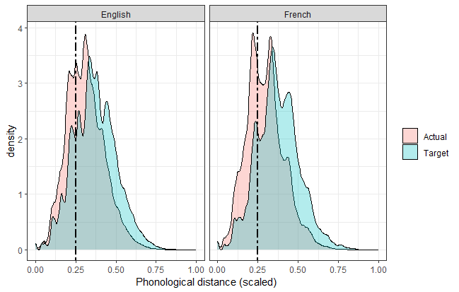

```{r setup, include=FALSE}

source("prelims.R")

# load files

globalthresholds_AOP <- feather::read_feather("Data/globalthresholds_AOP.feather")
full_thresholds <- feather::read_feather("Data/full_thresholds.feather")

regression_data_lyon <- feather::read_feather("Data/regression_data_lyon.feather")
regression_data_providence <- feather::read_feather("Data/regression_data_providence.feather")
regression_data <- rbind(regression_data_lyon, regression_data_providence) %>% 
  group_by(Speaker, age) %>% 
  mutate(INT_z = scale(INT_val),
         EXT_z = scale(EXT_target)) %>% ungroup()

comparison_data_P <- read_csv("Data/comparison_data_providence.csv")                                                            
comparison_data_L <- read_csv("Data/comparison_data_lyon.csv")
comparison_data <- rbind(comparison_data_P, comparison_data_L)

phon.dist.table <- read_csv("Data/phon_dist_table.csv")

globalthresholds_corr <- read_csv("Data/globalthresholds_corr.csv") %>%
  mutate(significant = ifelse(p.value<.05, "sig", "non-sig"))

all_distances <- read_csv("Data/all_distances.csv")

globalthresholds_AOP_thresholdstest <- feather::read_feather("Data/globalthresholds_AOP_thresholdstest.feather")
regression_data_lyon_thresholdstest <- feather::read_feather("ignore/large_files/regression_data_lyon_thresholdstest.feather")
regression_data_providence_thresholdstest <- feather::read_feather("ignore/large_files/regression_data_providence_thresholdstest.feather")
regression_data_thresholdstest <- rbind(regression_data_lyon_thresholdstest, 
                                        regression_data_providence_thresholdstest) %>%
  mutate(threshold = as.numeric(threshold)) %>% ungroup()

source("PhonologicalNetworks-Tables-SI.R")

stat_sum_df <- function(fun, geom="crossbar", ...) {
  stat_summary(fun.data=fun, colour="red", geom=geom, width=0.2, ...)
}

```

The supplementary materials below present further analyses and examples from the main study. This data is included here for transparency and further explanation, and to support replication and further analysis of this data. All scripts and data for the analysis can be found on the project’s OSF page at https://osf.io/uzrsy/?view_only=340858d2084245d087fc00fcca41b679.

The analyses below (S1:S5) show:

* S1: Demonstration of how phonological distance was calculated, with examples
* S2: Overview of how the connectivity threshold of 0.25 was established for the analysis
* S3: AoP ~ Degree connectivity across infants in the dataset
* S4: Full model output tables from the analyses in the main paper
* S5: By-speaker comparisons of the data
* S6: GAMMs with INT/EXT values scaled by speaker and age

### S1: Establishing phonological distance

Phonological distance was established following  Monaghan, Christiansen, Farmer and Fitneva's [-@monaghan_measures_2010] approach, with some adaptations. Note that in their study, only monosyllabic words are included, and so their approach is adapted here to include multisyllabic words. Following their method, each word was first divided into a series of 'slots', according to its phonological structure. For example, the word *baby* was separated into five slots: /b-e-i-b-i/. Because vowels were not accounted for, the nucleus of each syllable - both monophthongs and diphthongs - was then replaced by a generic V slot, i.e. /b-V-b-V/. Words were then aligned by nucleus to generate a phonological distance measure between each possible word pair. All consonants at word onset and final syllables were aligned, regardless of syllable number, such that the final /d/ of *bed* would be aligned with the final /n/ of *balloon*. This is because infants may have a tendency to produce only certain consonants word-finally, and so this approach would capture such systematicity. For the English data, the maximal word structure considered in the analysis is C-C-C-V-C-C-|C-C-C-V-|C-C-C-V-|C-C-C, where syllable boundaries are marked with a |. This accounts for complex clusters at word onset (e.g. *splash* \textipa{/spl\ae{}S/}, C-C-C-V-C), coda (*plant* \textipa{/pl\ae{}nt/}, C-C-V-C-C), and across syllable boundaries (*pumpkin* \textipa{/p2mpkIn/}, C-V-C-C-|C-V-C). In French the maximal structure was C-C-C-V-C-C-|C-C-C-V-|C-C-C-V-C|C-C-C-V-C|C-C-C-V-|C-C-C-C. This accounted for multisyllabic target words such as *hélicoptère* ("helicopter" \textipa{/elIkOptEK/}, V-|C-V-|C-V-C-|C-V-C) and *appareil photo* ("camera" \textipa{/apaKEjfOto/}, V-|C-V-|C-V-C-|C-V-|C-V), and complex codas as in *arbre* ("tree" \textipa{/aKbK/}, V-C-|C-C). For vowel-initial words, the C1 slot in word-initial position is empty, but all other alignments remain the same.

This maximal structure is required in an analysis of infant word production, to account for unexpected complexities such as, production of French *mettre* "to put" as \textipa{[mEKstK]} and *étoile* "star" as \textipa{[Estwal]}. In the infant data, it was not always easy to determine exactly where a syllable boundary should occur in complex productions, in part because this was not predictable based on the target form due to the variability in production, so would have to be done on a word-by-word basis, and in part because the syllable boundary of some productions could not be clearly established from its phonetic transcription. Instead, consonants were always assigned to the syllable-initial cluster, rather than assigning part of the cluster to the coda of the previous syllable (e.g. for the examples above, the infant production of *mettre* was coded as C-V-|C-C-C-C and *étoile* as V-|C-C-C-V-C).


```{r finalising phon dist table, echo=FALSE, message=FALSE, warning=FALSE}

col_baby <- phon.dist.table %>% unite(baby,
                                      Gloss.x, IPAtarget.x,
                                      sep = " /", remove = TRUE) %>%
  filter(word_pos == "S1C1") %>%
  dplyr::select(baby)

col_baby<- paste0(col_baby, "/")

col_balloon <- phon.dist.table %>% unite(balloon,
                                      Gloss.y, IPAtarget.y,
                                      sep = " /", remove = TRUE) %>%
  filter(word_pos == "S1C1") %>%
  dplyr::select(balloon)

stri_sub(col_balloon, 14, 1) <- ":" 
col_balloon<- paste0(col_balloon, "/")


col_sky <- phon.dist.table %>% unite(sky,
                                      Gloss, IPAtarget,
                                      sep = " /", remove = TRUE) %>%
  filter(word_pos == "S1C1") %>%
  dplyr::select(sky)

col_sky<- paste0(col_sky, "/")

sum_sq_diffs <- c("S1C1", "S1C2", "S2C1", "SFC1", "Phonological Distance ($\\sum\\sqrt\\text{total}$)")

phon.dist.table.final <- phon.dist.table %>%
  mutate(word_pos = sum_sq_diffs) %>% dplyr::select(word_pos, 
                                                           consonant.x, features.x,
                                                           consonant.y, features.y, sum_sq_diffs_balloon,
                                                           consonant, features, sum_sq_diffs_sky) %>%
  mutate(consonant.x = ifelse(is.na(consonant.x), " ", consonant.x),
         features.x = ifelse(is.na(features.x), " ", features.x),
         consonant.y = ifelse(is.na(consonant.y), " ", consonant.y),
         features.y = ifelse(is.na(features.y), " ", features.y),
         consonant = ifelse(is.na(consonant), " ", consonant),
         features = ifelse(is.na(features), " ", features))

```

Table \@ref(tab:table-phon-dist) shows examples of how phonological distance was calculated from the data.


```{r table-phon-dist, echo=FALSE, message=FALSE, warning=FALSE}
cap="Table showing how phonological distance was calculated across the dataset. Here distance is calculated between baby and both balloon and sky; note that only consonants were included in the phonological distance measure. Word position relates to each consonant's position in the word; features shows values of the 11 distinctive features that were used to generate distance values between each pair of words; sum squared differences shows the difference in values between baby and balloon/sky respectively. The phonological distance of each word pair is shown on the bottom row."

knitr::kable(phon.dist.table.final, "latex", booktabs=T, longtable=T, caption=cap, digits = 2, align="c",
      col.names=c("Word position[note]", 
                  "Cons.", "Features", 
                  "Cons.", "Features", "Sum sq. diffs", 
                  "Cons.", "Features", "Sum sq. diffs"),
      escape = FALSE)  %>%
   column_spec(1, width = "4cm") %>%
  column_spec(2, width = "1cm") %>%
  column_spec(3, width = "3cm") %>%
  column_spec(4, width = "1cm") %>%
  column_spec(5, width = "3cm") %>%
  column_spec(6, width = "3cm") %>%
  column_spec(7, width = "1cm") %>%
  column_spec(8, width = "3cm") %>%
  column_spec(9, width = "3cm") %>%
   kable_styling(font_size = 9)  %>%
   landscape() %>%
   add_header_above(c(" "=1, "Baby"=2, "Balloon"=3, "Sky"=3)) %>%
   add_footnote("S1 = first syllable, S2 = second syllable; C1 = first consonant, C2 = second consonant, CF = final consonant", 
                notation="alphabet")
```


### S2: Establishing connectivity within the networks

```{r peak correlations}

max_corrs <- globalthresholds_corr %>% 
  filter(!is.na(estimate)) %>%
  group_by(corpus, data_type) %>%
  summarise(rho = max(abs(estimate)))

optimum_E <- globalthresholds_corr %>%
  filter(abs(estimate) %in% max_corrs$rho) %>%
  group_by(corpus, data_type) %>%
  summarise(max_e = max(threshold))

```


To determine the 'cut-off' for connectivity in the networks (i.e., at what distance threshold are two words assumed to be connected within the network?), two approaches were taken: 

1) Spearman's correlation coefficients were generated between AoP and Degree for each word in the network along a series of 1000 connectivity thresholds between 0.01 and .99, following Amatuni and Bergelson [-@amatuni_semantic_2017]. This measure allows an overview of all potential connectivity in the networks; we expect a negative AoP~Degree correlation, since as the age of first production increases, a word should be less likely to connect to other nodes in the network. Figure \@ref(fig:aop-degree-correlation) below shows how this relationship changes at different threshold limits: for thresholds upto around .15, there is no predictable change in the AoP~Degree correlation as threshold increases, and indeed some of the correlations are not significant in this range (shown by open circles in Figure \@ref(fig:aop-degree-correlation)). On the other hand, from thresholds of around `r round(mean(optimum_E$max_e),2)` we start to see the relationship between AoP and Degree become less negative (i.e. rho moves closer to 0) and then plateau, such that connectivity in the network has reached its maximum potential connectivity, i.e. almost all nodes are connected. We can see that this happens on or shortly after a threshold of 0.5 for both datasets. Figure \@ref(fig:dist-density-plot) plots the distribution of scaled distances between all words in each infant's network. Here we can see that there are only few words in the dataset that have a distance of more than 0.5. A threshold between 0.15 and 0.5 is thus likely to capture the most appropriate representation of connectivity within the network.

```{r aop-degree-correlation, fig.cap=cap}

cap="Correlation coefficient (Spearman's rho) between age of production (AoP) and Degree across the dataset, at connectivity thresholds ranging from 0.01-0.99. Filled circles represent rho values that were signficant at p<.05; empty circles represent non-significant correlations. Dashed line shows selected connectivity threshold of 0.25."

thresholds.corr

```

2) Taking this into account, as reported in the main paper, a value one SD below the mean was accepted to be a suitable threshold for connectivity in the dataset. A threshold of 0.25 sits at the upper end of the lowest quartiles across each of the four datasets (French and English, each with Actual and Target data; range = `r round(min(subset(all_distances, corpus != "all")$Q1),2)`-`r round(max(subset(all_distances, corpus != "all")$Q1),2)`). 

```{r dist-density-plot, fig.cap = cap}

cap = "Density plot showing distribution of scaled phonological distance between word pairs in each infant's data. Plot is faceted by corpus; Actual data is shown in pink and Target data is shown in blue. The dashed line represents the connectivity threshold of 0.25, as applied in the analysis."



```


To further explore the extent to which the results are dependent on this threshold value, the data was re-analysed at a series of additional thresholds, representing the lower and upper limits of the analysable range discussed above (0.15-0.5), as well as each of the lower quartile values for the four individual datasets, and the overall mean connectivity in the data (`r round((subset(all_distances, corpus == "all")$mean_dist),2)`). The full dataset was regenerated seven times with each of these seven thresholds as a cut-off for connectivity (i.e. two nodes in the network were said to be connected at a threshold of <*n*, where *n* is the threshold being tested) and both the AoP~Degree correlations and the full GLMER models were run for both Actual and Target data, as in the main paper. Results are shown in Tables \@ref(tab:table-thresholdtest-actual) and \@ref(tab:table-thresholdtest-target).

\newpage

``` {r table-thresholdtest-actual, comment=F, message=F, warning = F, echo = F, results = "asis"}

cap = "Summary of key variables in the Actual dataset across seven different connectivity thresholds. At each threshold, the number of words that do not connect to any other word in the network is shown, alongisde Spearman's rho values for AoP~Degree correlation tests and model coefficients (estimates, p values and 95\\% confidence intervals) for GLMER models testing the effect of INT and EXT on word learning. GLMERs were the same as those reported in the main paper, varying only by connectivity threshold."

kable(actual.thresholdstest, "latex", booktabs=T, longtable=T, caption=cap, digits=2, align="c",
    col.names=c("Threshold", "Unconnected words", "Spearman's rho", 
                "Estimate", "p", "95% CI", 
                "Estimate", "p", "95% CI")) %>%
    kable_styling(font_size = 8,
                 full_width = F)%>%
  add_header_above(c(" "=3, "INT"=3, "EXT"=3))
```


``` {r table-thresholdtest-target, comment=F, message=F, warning = F, echo = F, results = "asis"}
cap = "Summary of key variables in the Target dataset across seven different connectivity thresholds. At each threshold, the number of words that do not connect to any other word in the network is shown, alongisde Spearman's rho values for AoP~Degree correlation tests and model coefficients (estimates, p values and 95\\% confidence intervals) for GLMER models testing the effect of INT and EXT on word learning. GLMERs were the same as those reported in the main paper, varying only by connectivity threshold."

kable(target.thresholdstest, "latex", booktabs=T, longtable=T, caption=cap, digits=2, align="c",
    col.names=c("Threshold", "Unconnected words", "Spearman's rho", 
                "Estimate", "p", "95% CI", 
                "Estimate", "p", "95% CI")) %>%
    kable_styling(font_size = 8,
                 full_width = F)%>%
  add_header_above(c(" "=3, "INT"=3, "EXT"=3))
```

\newpage

### S3: Age of production (AoP) ~ connectivity

``` {r table-aop-deg-corr, comment=F, message=F, warning = F, echo = F, results = "asis"}
cap = "Outputs (rho and p values) of AoP-degree Spearman's correlation tests for each infant in the dataset."

kable(table.aop.deg.corr.speaker, "latex", booktabs=T, longtable=T, 
      caption=cap, digits=2, align="c",
          col.names=c("Speaker", "Corpus", "Spearman's rho", "p", "Spearman's rho", "p")) %>%
    kable_styling() %>%
  add_header_above(c(" "=2, "Actual"=2, "Target"=2))
```


Table \@ref(tab:table-aop-deg-corr) and Figure \@ref(fig:Figure-AOP-deg-corr) show Spearman's correlation coefficients and corresponding p values, as well as visualized data, for AoP~Degree correlations at a threshold of 0.25 for each infant in the dataset.

```{r Figure-AOP-deg-corr, echo=FALSE, fig.pos='H', message=FALSE, warning=FALSE, fig.cap=cap}

cap <- sprintf("Age of production in relation to degree (z-score) of each word in the data. Individual points show individual word types produced in each month, with regression lines showing correlations for each infant. Data type (Actual vs. Target) is indexed by colour; shaded boxes show French data, un-shaded show English data.")

plot(cor.deg.AOP.fig)


```

\newpage

### S4: Network growth models: Full model outputs

Table \@ref(tab:full-data-summary) shows the full model outputs from the logistic mixed effects regression models run in the main paper, this time with word category included in the table.

```{r full model outputs, message=FALSE, warning=FALSE, include=FALSE}

reg_dat <- regression_data[which(complete.cases(regression_data[,c('EXT_scaled_target',
                                                                   'INT_scaled',
                                                                   'INT_z',
                                                                   'EXT_z',
                                                                   'length_scaled',
                                                                   'freq_scaled',
                                                                   'aoa_scaled',
                                                                   'age_scaled',
                                                                   'tokens_scaled',
                                                                   'corpus',
                                                                   'AOP',
                                                                   'category')])),]

reg_dat_scaled <- reg_dat %>% group_by(Speaker, age) %>% mutate(INT_z = scale(INT_val),
                                                                EXT_z = scale(EXT_target))

model3_A <- glmer(learned_next ~
                    INT_z*age_scaled +
                    EXT_z*age_scaled +
                    length_scaled*age_scaled +
                    freq_scaled*age_scaled +
                    aoa_scaled*age_scaled +
                    corpus +
                    category +
                    (1+age_scaled|Speaker),
                    family=binomial("logit"),
                    control=glmerControl(calc.derivs=FALSE,
                                         optimizer="bobyqa",
                                         optCtrl=list(maxfun=2e5)),
                    data=subset(reg_dat_scaled, data_type == "actual"))

confint.model3_A <- tidy(model3_A,effects="fixed",conf.int=TRUE) %>%
  select(term, conf.low, conf.high) %>%
  mutate(across(where(is.numeric), round, 2)) %>%
  unite(`95% CI`, c(conf.low, conf.high), sep = ",",)

confint.model3_A$`95% CI` <- paste0("[", confint.model3_A$`95% CI`, "]")

model.summary_A <- summary(model3_A)

model3_A_tab <- model.summary_A$coefficients %>%
  as.data.frame %>%
  rename(
    "b"="Estimate"
     , "SE"="Std. Error"
     , "z"="z value"
     , "p"="Pr(>|z|)") %>%
  mutate(
    Effect=papaja:::beautify_terms(rownames(.))
  )

table.model3_A <- model3_A_tab %>%
  printnum(
    digits=c(2, 2, 2, 3)
    , gt1=c(TRUE, TRUE, TRUE, TRUE)
    , zero=c(TRUE, TRUE, TRUE, TRUE)
  ) %>%
  rownames_to_column(var = "term") %>%
  left_join(confint.model3_A) %>%
  select(Effect, `b`, `SE`, `z`, `p`, `95% CI`) %>%
  rename("beta"=`b`) %>%
  mutate(beta=as.numeric(beta),
        SE=as.numeric(SE),
        `z`=as.numeric(`z`),
        `p`=as.numeric(`p`),
             p=scales::pvalue(p))

model3_T <- glmer(learned_next ~
                    INT_z*age_scaled +
                    EXT_z*age_scaled +
                    length_scaled*age_scaled +
                    freq_scaled*age_scaled +
                    aoa_scaled*age_scaled +
                    corpus +
                    category +
                    (1+age_scaled|Speaker),
                    family=binomial("logit"),
                    control=glmerControl(calc.derivs=FALSE,
                                         optimizer="bobyqa",
                                         optCtrl=list(maxfun=2e5)),
                    data=subset(reg_dat, data_type == "target"))

confint.model3_T <- tidy(model3_T,effects="fixed",conf.int=TRUE) %>%
  select(term, conf.low, conf.high) %>%
  mutate(across(where(is.numeric), round, 2)) %>%
  unite(`95% CI`, c(conf.low, conf.high), sep = ",",)

confint.model3_T$`95% CI` <- paste0("[", confint.model3_T$`95% CI`, "]")

model.summary_T <- summary(model3_T)

model3_T_tab <- model.summary_T$coefficients %>%
  as.data.frame %>%
  rename(
    "b"="Estimate"
     , "SE"="Std. Error"
     , "z"="z value"
     , "p"="Pr(>|z|)") %>%
  mutate(
    Effect=papaja:::beautify_terms(rownames(.))
  )

table.model3_T <- model3_T_tab %>%
  printnum(
    digits=c(2, 2, 2, 3)
    , gt1=c(TRUE, TRUE, TRUE, TRUE)
    , zero=c(TRUE, TRUE, TRUE, TRUE)
  ) %>%
  rownames_to_column(var = "term") %>%
  left_join(confint.model3_T) %>%
  select(Effect, `b`, `SE`, `z`, `p`, `95% CI`) %>%
  rename("beta"=`b`) %>%
  mutate(beta=as.numeric(beta),
        SE=as.numeric(SE),
        `z`=as.numeric(`z`),
        `p`=as.numeric(`p`),
             p=scales::pvalue(p))

rownames(table.model3_T) <- NULL

table.model.3 <- cbind(table.model3_A, table.model3_T)
table.model.summary <- table.model.3[,-7]

rownames(table.model.summary) <- NULL
table.model.3 <- cbind(table.model3_A, table.model3_T)
table.model.summary <- table.model.3[,-7]

table.model.summary <- table.model.summary %>% mutate(Effect=fct_recode(Effect,
                                              `EXT value`="EXT z",
                                              `INT value`="INT z",
                                              Age="Age scaled",
                                               AoA="Aoa scaled",
                                               Length="Length scaled",
                                              `Input frequency`="Freq scaled",
                                              `Corpus` = "CorpusEnglish",
                                              `Category: verbs` = "Categoryverbs",
                                              `Category: object words` = "Categoryobject word",
                                              `Category: connecting words` = "Categoryconnecting words",
                                              `Category: adjectives` = "Categorydescriptive words",
                                              `Category: games/routines` = "Categorygames routines",
                                              `Category: prepositions` = "Categoryprepositions",
                                              `Category: pronouns` = "Categorypronouns",
                                              `Category: quantifiers` = "Categoryquantifiers",
                                              `Category: question words` = "Categoryquestion words",
                                              `Category: onomatopoeia`= "Categorysounds",
                                              `Category: time` = "Categorytime words",
                                              `Category: locations` = "Categorylocations",
                                              `Age x AoA`="Age scaled $\\times$ Aoa scaled",
                                              `Age x Length`="Age scaled $\\times$ Length scaled",
                                              `Age x Input frequency`="Age scaled $\\times$ Freq scaled",
                                              `Age x EXT`="Age scaled $\\times$ EXT z",
                                              `Age x INT`="INT z $\\times$ Age scaled"))


var_order <- c("Intercept", "INT value", "EXT value", "Age", "AoA", "Length", "Input frequency", "Corpus", 
               "Category: verbs",
               "Category: object words",
               "Category: connecting words",
               "Category: adjectives",
               "Category: games/routines",
               "Category: prepositions",
               "Category: pronouns",
               "Category: quantifiers",
               "Category: question words",
               "Category: onomatopoeia",
               "Category: time",
               "Category: locations",
               "Age x INT",
               "Age x EXT",
               "Age x AoA",
               "Age x Length",
               "Age x Input frequency")

table.model.summary.full <- table.model.summary %>%
          arrange(factor(Effect, levels = var_order))

rownames(table.model.summary.full) <- NULL

```


```{r full-data-summary, echo=FALSE, message=FALSE, warning=FALSE, comment=F}
cap="Results from maximal logistic regression model (model 3) testing the effects of network growth values, corpus (English as baseline), input frequency, comprehensive AoA, word category (nouns as baseline) and word length to predict word acquisition. All variables were scaled and centred. Word category was defined according to word categories on the McArthur Bates CDI (Fenson et al., 1994)."
knitr::kable(table.model.summary.full, "latex", booktabs=T, longtable=T, caption=cap, digits=2, align="c",
          col.names=gsub("[.1]", "", names(table.model.summary))) %>%
  kable_styling(font_size = 7) %>%
  add_header_above(c(" "=1, "Actual"=4, "Target"=4))
```

\newpage

### S5: By-speaker comparisons

Between-child differences are well established in the phonological development literature [@maekawa_individual_2006; @vihman_phonological_1986]. There is thus reason to expect that the nine infants in the current dataset may have differential paths to word production, and so results may be variable when considered across speakers. Figure \@ref(fig:by-speaker-data) below shows a by-infant breakdown of the INT value trajectories visualised in Figure 4 of the main paper. Descriptively, in Anais, Nathan and Alex's data, INT values increase exponentially over time, suggesting that INT is an increasingly influential factor in their early production. On the other hand, INT values plateau relatively early in the data for William, Naima and Lily, suggesting that other factors may have a stronger influence in these infants’ word production and acquisition after a certain time-point.


```{r by-speaker-data, echo=FALSE, fig.cap=cap}
cap="Smooth plot showing scaled INT values in Actual vs. Target forms. Shaded areas show 95% confidence intervals, lines indicate mean trajectories over time, coloured circles represent individual datapoints, jittered for visual clarity. Plot is faceted by infant for comparison across subjects."
data.type.plot.bysubj
```


\newpage

