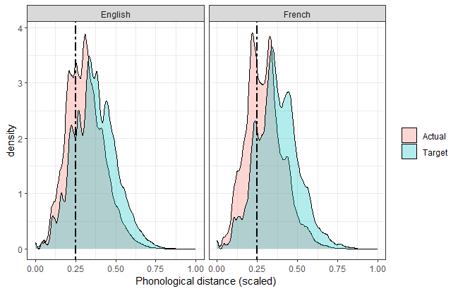

```{r setup, include=FALSE}

source("prelims.R")

r_refs(file="r-references.bib")

my_citations <- cite_r(
  file="r-references.bib"
  , pkgs=c("tidyverse", "igraph", "papaja", "lmerTest")
  , withhold=FALSE
  , footnote=TRUE
)

# load files

globalthresholds_AOP <- feather::read_feather("Data/globalthresholds_AOP.feather")
full_thresholds <- feather::read_feather("Data/full_thresholds.feather")

regression_data_lyon <- feather::read_feather("Data/regression_data_lyon.feather")
regression_data_providence <- feather::read_feather("Data/regression_data_providence.feather")
regression_data <- rbind(regression_data_lyon, regression_data_providence)

comparison_data_P <- read_csv("Data/comparison_data_providence.csv")                                                            
comparison_data_L <- read_csv("Data/comparison_data_lyon.csv")
comparison_data <- rbind(comparison_data_P, comparison_data_L)

phon.dist.table <- read_csv("Data/phon_dist_table.csv")

globalthresholds_corr <- read_csv("Data/globalthresholds_corr.csv") %>%
  mutate(significant = ifelse(p.value<.05, "sig", "non-sig"))

all_distances <- read_csv("Data/all_distances.csv")

data_CG <- read_feather("Data/regression_data_CG.feather")
#globalthresholds_AOP_CG <- read_feather("Data/globalthresholds_AOP_CG.feather") %>% filter(threshold == 0.25)

globalthresholds_AOP_thresholdstest <- feather::read_feather("Data/globalthresholds_AOP_thresholdstest.feather")
regression_data_lyon_thresholdstest <- feather::read_feather("ignore/large_files/regression_data_lyon_thresholdstest.feather")
regression_data_providence_thresholdstest <- feather::read_feather("ignore/large_files/regression_data_providence_thresholdstest.feather")
regression_data_thresholdstest <- rbind(regression_data_lyon_thresholdstest, regression_data_providence_thresholdstest) %>%
  mutate(threshold = as.numeric(threshold)) %>% ungroup()

# source("PhonologicalNetworks-Figures.R")
source("PhonologicalNetworks-Tables-SI.R")

stat_sum_df <- function(fun, geom="crossbar", ...) {
  stat_summary(fun.data=fun, colour="red", geom=geom, width=0.2, ...)
}

rename_vars <- c(
                    `actual` = "Actual",
                    `target` = "Target"
                    )

```

```{r Figures for SI, include=FALSE}

thresholds_corr <- ggplot(subset(globalthresholds_corr, !is.na(estimate)), 
       aes(x = threshold, y = as.numeric(estimate), colour = corpus, shape = significant)) +
  geom_point() +
  scale_shape_manual(values = c(1, 16)) +
  ylab("Spearman's rho") +
  xlab("Threshold") +
  guides(color=guide_legend(""), shape = "none") +
  theme_bw() +
  geom_vline(xintercept = 0.25, linetype = "twodash", colour = "darkgrey") +
  facet_wrap(~data_type, ncol=2)

data_type_plot_bysubj <- ggplot(data = subset(regression_data, age == (AOP-1)), aes(x = age, y = INT_scaled, colour = data_type)) +
  geom_point(shape = 21, position = position_jitter(.1)) +
  geom_smooth(aes(fill = data_type)) +
  ylab("INT value (normalised)") +
  xlab("Age (months)") +
  ggtitle("Figure S4") +
  theme_bw(base_size = 18) +
  theme(legend.title = element_blank()) +
  facet_wrap(~Speaker, ncol=3)
```

The supplementary materials below present further analyses and examples from the main study. This data is included here for transparency and further explanation, and to support replication and further analysis of this data. All scripts and data for the analysis can be found on the project’s GitHub page at https://github.com/cathelaing/PhonologicalNetworks.

The analyses below (S1:S3) show:

* S1: Demonstration of how phonological distance was calculated with examples
* S2: Correlations between age of production (AoP) and network connectivity
* S3: Full model output tables from the analyses in the main paper
* S4: By-speaker comparisons
* S5: Random network analysis

### S1: Establishing phonological distance

Phonological distance was established following  Monaghan, Christiansen, Farmer and Fitneva's [-@monaghan_measures_2010] approach, with some adaptations. Note that in their study, only monosyllabic words are included, and so their approach is adapted to include multisyllabic words. Following their method, each word was divided into a series of 'slots', following its phonological structure. For example, the word *baby* was separated into five slots: /b-e-i-b-i/. Because vowels were not accounted for, the nucleus of each syllable - both simple monophthongs and complex diphthongs - was replaced by a generic V slot, i.e. /b-V-b-V/. Words were then aligned by nucleus to generate a phonological distance measure between each possible word pair. All consonants at word onset and all word-final codas were aligned, regardless of syllable number, such that the final /d/ of *bed* would be aligned with the final /n/ of *balloon*. This is because infants may have a tendency to produce certain consonants word-finally, and so this approach would capture such systematicity. For the English data, the maximal word structure considered in the analysis is C-C-C-V-C-C-|C-C-C-V-|C-C-C-V-|C-C-C, where syllable boundaries are marked with a |. This accounts for complex clusters at word onset (e.g. *splash*, C-C-C-V-C), syllable coda (*plant*, C-C-V-C-C), and across syllable boundaries (*pumpkin*, C-V-C-C-|C-V-C). In French the maximal structure was C-C-C-V-C-C-|C-C-C-V-|C-C-C-V-C|C-C-C-V-C|C-C-C-V-|C-C-C-C. This accounted for multisyllabic target words such as *hélicoptère* ("helicopter", V-|C-V-|C-V-C-|C-V-C) and *appareil photo* ("camera", V-|C-V-|C-V-C-|C-V-|C-V), and complex codas as in *arbre* ("tree", V-|C-C-C). For vowel-initial words, the C1 slot in word-initial position is empty, but all other alignments remain the same, such that the first consonant is coded in C1 position on the second syllable, as in the examples before.

This maximal structure is required in an analysis of infant word production, to account for unexpected complexities such as, production of French *mettre* "to put" as /mɛʀstʀ/ and *étoile* "star" as /ɛstwal/. In the infant data, it was not possible to consistently assign codas to complex productions, and so consonants were always assigned to the syllable-initial cluster, rather than assigning part of the cluster to the coda of the previous syllable (e.g. for the examples above, the infant production of *mettre* was coded as C-V-|C-C-C-C and *étoile* as V-|C-C-C-V-C).

Table XXX shows examples of how phonological distance was calculated from the data.

```{r finalising phon dist table, echo=FALSE, message=FALSE, warning=FALSE}

col_baby <- phon.dist.table %>% unite(baby,
                                      Gloss.x, IPAtarget.x,
                                      sep = " /", remove = TRUE) %>%
  filter(word_pos == "S1C1") %>%
  dplyr::select(baby)

col_baby<- paste0(col_baby, "/")

col_balloon <- phon.dist.table %>% unite(balloon,
                                      Gloss.y, IPAtarget.y,
                                      sep = " /", remove = TRUE) %>%
  filter(word_pos == "S1C1") %>%
  dplyr::select(balloon)

stri_sub(col_balloon, 14, 1) <- ":" 
col_balloon<- paste0(col_balloon, "/")


col_sky <- phon.dist.table %>% unite(sky,
                                      Gloss, IPAtarget,
                                      sep = " /", remove = TRUE) %>%
  filter(word_pos == "S1C1") %>%
  dplyr::select(sky)

col_sky<- paste0(col_sky, "/")

phon.dist.table.final <- phon.dist.table %>% dplyr::select(word_pos, 
                                                           consonant.x, features.x,
                                                           consonant.y, features.y, sum_sq_diffs_balloon,
                                                           consonant, features, sum_sq_diffs_sky) %>%
  mutate(word_pos = fct_recode(word_pos,
                               "S2CF" = "SFC1"))

```

```{r table-model-outputs, echo=FALSE, message=FALSE, warning=FALSE}
cap="Table showing how phonological distance was calculated across the dataset. Here distance is calculated between *baby* and both *balloon* and *sky*; note that only consonants were included in the phonological distance measure. Word position relates to each consonant's position in the word; features shows values of the 11 distinctive features that were used to generate distance values between each pair of words; sum squared differences shows the difference in values between *baby* and *balloon*/*sky* respectively. The phonological distance of each word pair is shown on the bottom row."
kable(phon.dist.table.final, "latex", booktabs=T, longtable=T, caption=cap, digits = 2, align="c", escape = F,
      col.names=c("Word position[note]", 
                  "Consonant", "Features", 
                  "Consonant", "Features", "Sum squared differences", 
                  "Consonant", "Features", "Sum squared differences")) %>%
   kable_styling()%>%
   add_header_above(c(" "=1, col_baby=2, col_balloon=3, col_sky=3)) %>%
   add_footnote("S1 = first syllable, S2 = second syllable; C1 = first consonant, C2 = second consonant, CF = final consonant.", notation="alphabet")
```

### S2: Establishing connectivity within the networks

```{r peak correlations}

max_corrs <- globalthresholds_corr %>% 
  filter(!is.na(estimate)) %>%
  group_by(corpus, data_type) %>%
  summarise(rho = max(abs(estimate)))

optimum_E <- globalthresholds_corr %>%
  filter(abs(estimate) %in% max_corrs$rho) %>%
  group_by(corpus, data_type) %>%
  summarise(max_e = max(threshold))

```

To determine the 'cut-off' for connectivity in the networks (i.e., at what distance threshold are two words assumed to be connected within the network), two approaches were taken: 

1) Spearman's correlation coefficients were generated between AoP and Degree for each word in the network along a series of 1000 connectivity thresholds (ε) between 0.01 and .99, following Amatuni and Bergelson [-@amatuni_semantic_2017]. This measure allows an overview of all potential connectivity in the networks; we expect a negative AoP~Degree correlation, since as the age of first production increases, it should be less likely to connect to other nodes in the network. Figure \@ref(fig:aop-degree-correlation) below shows how this relationship changes at different threshold limits: for thresholds upto around ε=.15, there is no predictable change in the AoP~Degree correlation as threshold increases, and indeed some of the correlations are not significant in this range (shown by open circles in Figure \@ref(fig:aop-degree-correlation)). On the other hand, from thresholds of around `r round(mean(optimum_E$max_e),2)` we start to see the relationship between AoP and Degree become less negative (i.e. ρ moves closer to 0) and then plateau, such that connectivity in the network has reached its maximum potential connectivity, i.e. almost all nodes are connected. We can see that this happens on or shortly after ε=0.5 for all datasets. Figure \@ref(fig:dist-density-plot) plots the distribution of scaled distances between all words in each infant's network. Here we can see that there are very few words in the dataset that have a distance of more than ε=0.5. A threshold between ε=0.15 and ε=0.5 is thus likely to capture the most appropriate representation of connectivity within the network.

```{r aop-degree-correlation, cap = cap}
cap="Correlation coefficient (Spearman's ρ) between age of production (AoP) and Degree across the dataset, at connectivity thresholds ranging from ε=0.01-0.99. Filled circles represent ρ values that were signficant at p<.05; empty circles represent non-significant correlations. Dashed line shows selected connectivity threshold of ε=0.25."
thresholds_corr
```

```{r dist-density-plot, cap = cap}
cap = "Density plot showing distribution of scaled phonological distance between word pairs in each infant's data. Plot is faceted by corpus; Actual data is shown in pink and Target data is shown in blue. The dashed line represents the connectivity threshold of E=0.25, as applied in the analysis."

```

2) Taking this into account, as reported in the main paper, a value one SD below the mean was accepted to be a suitable threshold for connectivity in the dataset. A threshold of ε=0.25 sits at the upper end of the lowest quartile for each of the four datasets (French and English, each with Actual and Target data; range = `r round(min(subset(all_distances, corpus != "all")$Q1),2)`-`r round(max(subset(all_distances, corpus != "all")$Q1),2)`). 

To further explore the extent to which the results are dependent on this threshold value, the data was re-analysed at a series of additional thresholds, representing the lower and upper limits of the analysable range discussed above (ε=0.15-0.5), as well as each of the lowest quartile values for the four individual datasets and the overall mean connectivity in the data (ε=`r round((subset(all_distances, corpus == "all")$mean_dist),2)`). The full dataset was regenerated seven times with each of these seven thresholds as a cut-off for connectivity (i.e. two nodes in the network were said to be connected at a threshold of ε=<*n*, where *n* is the threshold being tested) and both the AoP~degree correlations and the full GLMER models were run for both Actual and Target data, as in the main paper. Results are shown in Tables \@ref(tab:table-thresholdtest-actual) and \@ref(tab:table-thresholdtest-target).

``` {r table-thresholdtest-actual, comment=F, message=F, warning = F, echo = F, results = "asis"}
cap = "ADD"

kable(actual.thresholdstest, "latex", booktabs=T, longtable=T, caption=cap, digits=2, align="c",
    col.names=c("Threshold", "Unconnected words", "Spearman's rho", "Estimate", "p", "95% CI", "Estimate", "p", "95% CI")) %>%
    kable_styling()%>%
  add_header_above(c(" "=3, "INT"=3, "EXT"=3))
```

``` {r table-thresholdtest-target, comment=F, message=F, warning = F, echo = F, results = "asis"}
cap = "ADD"

kable(target.thresholdstest, "latex", booktabs=T, longtable=T, caption=cap, digits=2, align="c",
    col.names=c("Threshold", "Unconnected words", "Spearman's rho", "Estimate", "p", "95% CI", "Estimate", "p", "95% CI")) %>%
    kable_styling()%>%
  add_header_above(c(" "=3, "INT"=3, "EXT"=3))
```

### S3: Age of production (AoP) ~ connectivity

``` {r table-aop-deg-corr, comment=F, message=F, warning = F, echo = F, results = "asis"}
cap = "Outputs (rho and p values) of AoP-degree Spearman's correlation tests for each infant in the dataset."

kable(table.aop.deg.corr.speaker, "latex", booktabs=T, longtable=T, 
      caption=cap, digits=2, align="c",
          col.names=c("Speaker", "Corpus", "Spearman's rho", "p", "Spearman's rho", "p")) %>%
    kable_styling()%>%
  add_header_above(c(" "=2, "Actual"=2, "Target"=2)))
```

```{r Figure-AOP-deg-corr, echo=FALSE, fig.pos='H', message=FALSE, warning=FALSE}


plot(cor_deg_AOP.fig)


# cap <- sprintf("S1: Age of production in relation to degree (z-score) of each word in the data. Individual points show individual word types produced in each month, with regression lines showing correlations for each infant. Data type (Actual vs. Target) is indexed by colour; shaded boxes show French data, un-shaded show English data.")
```


\newpage

### S3: Network growth models: Full model outputs

```{r regression model actual, message=FALSE, warning=FALSE, include=FALSE}

reg_dat <- regression_data[which(complete.cases(regression_data[,c('PAQ_scaled_target', 'PAT_scaled', 'length_scaled', 'freq_scaled', 'age_scaled', 'corpus')])),]

model3_A <- glmer(learned_next ~
                    length_scaled*age_scaled +
                    tokens_scaled*age_scaled +
                      freq_scaled*age_scaled +
                    corpus +
                    category +
                    PAQ_scaled_target*age_scaled +
                      PAT_scaled*age_scaled +
                    (1+age_scaled|Speaker),
                    family=binomial("logit"),
                    control=glmerControl(calc.derivs=FALSE,
                                         optimizer="bobyqa",
                                         optCtrl=list(maxfun=2e5)),
                    data=subset(reg_dat, data_type == "actual"))


model.summary_A <- summary(model3_A)

model3_T <- glmer(learned_next ~
                  length_scaled*age_scaled +
                  tokens_scaled*age_scaled +
                  freq_scaled*age_scaled +
                  corpus +
                  category +
                  PAQ_scaled_target*age_scaled +
                  PAT_scaled*age_scaled +
                  (1+age_scaled|Speaker),
                    family=binomial("logit"),
                    control=glmerControl(calc.derivs=FALSE,
                                         optimizer="bobyqa",
                                         optCtrl=list(maxfun=2e5)),
                    data=subset(reg_dat, data_type == "target"))

model.summary_T <- summary(model3_T)

model3_A_tab <- model.summary_A$coefficients %>%
  as.data.frame %>%
  rename(
    "b"="Estimate"
     , "SE"="Std. Error"
     , "z"="z value"
     , "p"="Pr(>|z|)") %>%
  mutate(
    Effect=papaja:::beautify_terms(rownames(.))
  )

table.model3_A <- model3_A_tab %>%
  printnum(
    digits=c(2, 2, 2, 3)
    , gt1=c(TRUE, TRUE, TRUE, TRUE)
    , zero=c(TRUE, TRUE, TRUE, TRUE)
  ) %>%
  select(Effect, `b`, `SE`, `z`, `p`) %>%
  rename("beta"=`b`) %>%
  mutate(beta=as.numeric(beta),
        SE=as.numeric(SE),
        `z`=as.numeric(`z`),
        `p`=as.numeric(`p`),
             p=scales::pvalue(p))

model3_T_tab <- model.summary_T$coefficients %>%
  as.data.frame %>%
  rename(
    "b"="Estimate"
     , "SE"="Std. Error"
     , "z"="z value"
     , "p"="Pr(>|z|)") %>%
  mutate(
    Effect=papaja:::beautify_terms(rownames(.))
  )

table.model3_T <- model3_T_tab %>%
  printnum(
    digits=c(2, 2, 2, 3)
    , gt1=c(TRUE, TRUE, TRUE, TRUE)
    , zero=c(TRUE, TRUE, TRUE, TRUE)
  ) %>%
  select(Effect, `b`, `SE`, `z`, `p`) %>%
  rename("beta"=`b`) %>%
  mutate(beta=as.numeric(beta),
        SE=as.numeric(SE),
        `z`=as.numeric(`z`),
        `p`=as.numeric(`p`),
             p=scales::pvalue(p))

rownames(table.model3_T) <- NULL

table.model.3 <- cbind(table.model3_A, table.model3_T)
table.model.summary <- table.model.3[,-6]

table.model.summary.full <- table.model.summary %>% mutate(Effect=fct_recode(Effect,
                                               Age="Age scaled",
                                               Length="Length scaled",
                                               `n Tokens` = "Tokens scaled",
                                              `Input frequency`="Freq scaled",
                                              `Corpus` = "CorpusEnglish",
                                              `EXT value`="PAQ scaled target",
                                              `INT value`="PAT scaled",
                                              `Category: object words` = "Categoryobject word",
                                              `Category: connecting words` = "Categoryconnecting words",
                                              `Category: adjectives` = "Categorydescriptive words",
                                              `Category: games/routines` = "Categorygames routines",
                                              `Category: prepositions` = "Categoryprepositions",
                                              `Category: pronouns` = "Categorypronouns",
                                              `Category: quantifiers` = "Categoryquantifiers",
                                              `Category: question words` = "Categoryquestion words",
                                              `Category: onomatopoeia`= "Categorysounds",
                                              `Category: time` = "Categorytime words",
                                              `Category: locations` = "Categorylocations",
                                              `Age x Length`="Length scaled $\\times$ Age scaled",
                                              `Age x n Tokens` = "Age scaled $\\times$ Tokens scaled",
                                              `Age x Frequency`="Age scaled $\\times$ Freq scaled",
                                              `Age x EXT`="Age scaled $\\times$ PAQ scaled target",
                                              `Age x INT`="Age scaled $\\times$ PAT scaled"))

rownames(table.model.summary.full) <- NULL

```

```{r full-data-summary, echo=FALSE, message=FALSE, warning=FALSE, comment=F}
cap="Results from maximal logistic regression model (model 3) testing the effects of network growth values, corpus (English as baseline), input frequency, vocabulary size, word category, n tokens and word length to predict word acquisition. All variables were scaled and centred. Word category was defined according to word categories on the McArthur Bates CDI (Fenson et al., 1994)"
knitr::kable(table.model.summary.full, "latex", booktabs=T, longtable=T, caption=cap, digits=2, align="c",
          col.names=gsub("[.1]", "", names(table.model.summary))) %>%
  add_header_above(c(" "=1, "Actual"=4, "Target"=4))
```

### S4: By-speaker comparisons

Between-child differences are well established in the phonological development literature [@maekawa_individual_2006; @vihman_phonological_1986]. There is thus reason to expect that the nine infants in the current dataset may have differential paths to word production, and so results may be variable when considered across speakers. Figure \@ref(fig:by-speaker-data) below shows a by-infant breakdown of the INT value trajectories visualised in Figure 4 of the main paper. Descriptively, in Anais, Nathan and Alex's data, INT values increase exponentially over time, suggesting that INT is an increasingly influential factor in their early production. On the other hand, INT values plateau relatively early in the data for William, Naima and Lily, suggesting that other factors may have a stronger influence in these infants’ word production and acquisition after a certain time-point.

```{r by-speaker-data, cap = cap}
cap="Smooth plot showing scaled INT values in Actual vs. Target forms. Shaded areas show 95%% confidence intervals, lines indicate mean trajectories over time, coloured circles represent individual datapoints, jittered for visual clarity. Plot is faceted by infant for comparison across subjects."
data_type_plot_bysubj
```

### S5: Random network analysis

```{r}

cor.test(globalthresholds_AOP_CG$AOP, globalthresholds_AOP_CG$degree, method="sp")

ggplot(globalthresholds_AOP_CG, aes(x = AOP, y = degree)) + geom_smooth()

plot(globalthresholds_AOP_CG$AOP, globalthresholds_AOP_CG$degree)

data_CG_older <- data_CG %>% 
  filter(age>19) %>%
  group_by(Speaker, AOP) %>%
  mutate(INT_z = (INT_val-mean(INT_val))/sd(INT_val))
data_CG_younger <- data_CG %>% 
  filter(AOP<20) %>%
  group_by(Speaker, AOP) %>%
  mutate(INT_z = (INT_val-mean(INT_val))/sd(INT_val))

all_CG_data <- rbind(data)

data_CG %>% group_by(learned_next) %>% tally()

data_CG %>% distinct(Speaker, AOP, gloss1) %>% group_by(Speaker, AOP) %>% tally()


model0_A <- glmer(learned_next ~
                    freq_scaled * age_scaled +
                    (1+age_scaled|Speaker),
                    family=binomial("logit"),
                    control=glmerControl(calc.derivs=FALSE,
                                         optimizer="bobyqa",
                                         optCtrl=list(maxfun=2e5)),
                    data=data_CG)


model1_A_CG <- glmer(learned_next ~
                   #corpus +
                    INT_scaled * freq_scaled * age_scaled * EXT_scaled +
                    (1+age_scaled|Speaker), 
                    family=binomial("logit"),
                    control=glmerControl(calc.derivs=FALSE,
                                         optimizer="bobyqa",
                                         optCtrl=list(maxfun=2e5)),
                    data=data_CG)
confint.model1_A_CG <- tidy(model1_A_CG,effects="fixed",conf.int=TRUE)
summary(model1_A_CG)


model1_A <- lmer(AOP_scaled ~
                   #corpus +
                    INT_scaled*freq_scaled +
                    (1|Speaker), 
                    # control=glmerControl(calc.derivs=FALSE,
                    #                      optimizer="bobyqa",
                    #                      optCtrl=list(maxfun=2e5)),
                    data=data_CG, REML = F)

anova(model0_A, model1_A)
summary(model1_A)


model2_A <- glmer(learned_next ~
                    #corpus +
                    PAQ_scaled_target*age_scaled +
                    (1+age_scaled|Speaker),
                    family=binomial("logit"),
                    control=glmerControl(calc.derivs=FALSE,
                                         optimizer="bobyqa",
                                         optCtrl=list(maxfun=2e5)),
                    data=subset(regression_data_rand, data_type == "actual"))


models01_A <- anova(model0_A, model1_A)
models02_A <- anova(model0_A, model2_A)

model3_A <- glmer(learned_next ~
                    #corpus +
                    PAT_scaled*age_scaled +
                      PAQ_scaled_target*age_scaled +
                    (1+age_scaled|Speaker),
                    family=binomial("logit"),
                    control=glmerControl(calc.derivs=FALSE,
                                         optimizer="bobyqa",
                                         optCtrl=list(maxfun=2e5)),
                    data=subset(regression_data_rand, data_type == "actual"))

models13_A <- anova(model1_A, model3_A)
models23_A <- anova(model2_A, model3_A)


```

## Network growth models with randomized data

```{r regression model actual, message=FALSE, warning=FALSE, include=FALSE}

reg_dat_rand <- regression_data_rand[which(complete.cases(regression_data_rand[,c('PAQ_scaled_target', 'PAT_scaled', 'length_scaled', 'freq_scaled', 'age_scaled', 'corpus')])),]

model0_A <- glmer(learned_next ~
                    length_scaled*age_scaled +
                    tokens_scaled*age_scaled +
                    freq_scaled*age_scaled +
                    vocab_scaled*age_scaled +
                    corpus +
                    #category +                 # commenting this out for now as it takes too long to run!
                    (1+age_scaled|Speaker),
                    family=binomial("logit"),
                    control=glmerControl(calc.derivs=FALSE,
                                         optimizer="bobyqa",
                                           # specifiying optimizer to support convergence (does not converge without this)
                                         optCtrl=list(maxfun=2e5)),
                    data=subset(reg_dat_rand, data_type == "actual"))

model1_A <- glmer(learned_next ~
                  length_scaled*age_scaled +
                    tokens_scaled*age_scaled +
                  freq_scaled*age_scaled +
                    vocab_scaled*age_scaled +
                   corpus +
                    #category +
                    PAT_scaled*age_scaled +
                    (1+age_scaled|Speaker), 
                    family=binomial("logit"),
                    control=glmerControl(calc.derivs=FALSE,
                                         optimizer="bobyqa",
                                         optCtrl=list(maxfun=2e5)),
                    data=subset(reg_dat_rand, data_type == "actual"))

model2_A <- glmer(learned_next ~
                  length_scaled*age_scaled +
                    tokens_scaled*age_scaled +
                  freq_scaled*age_scaled +
                    vocab_scaled*age_scaled +
                    corpus +
                    #category +
                    PAQ_scaled_target*age_scaled +
                    (1+age_scaled|Speaker),
                    family=binomial("logit"),
                    control=glmerControl(calc.derivs=FALSE,
                                         optimizer="bobyqa",
                                         optCtrl=list(maxfun=2e5)),
                    data=subset(reg_dat_rand, data_type == "actual"))


models01_A <- anova(model0_A, model1_A)
models02_A <- anova(model0_A, model2_A)

model3_A <- glmer(learned_next ~
                    length_scaled*age_scaled +
                    tokens_scaled*age_scaled +
                      freq_scaled*age_scaled +
                    vocab_scaled*age_scaled +
                    corpus +
                    #category +
                    PAT_scaled*age_scaled +
                      PAQ_scaled_target*age_scaled +
                    (1+age_scaled|Speaker),
                    family=binomial("logit"),
                    control=glmerControl(calc.derivs=FALSE,
                                         optimizer="bobyqa",
                                         optCtrl=list(maxfun=2e5)),
                    data=subset(reg_dat_rand, data_type == "actual"))

models13_A <- anova(model1_A, model3_A)
models23_A <- anova(model2_A, model3_A)

#summary(model3_A)

table.A.model.output_rand <- rbind(models01_A, models02_A, models13_A, models23_A) %>%
  rownames_to_column(var="Model") %>%
  filter(Chisq > 0) %>%
  rename("p"=`Pr(>Chisq)`) %>%
  mutate(Model=fct_recode(Model,
                           "null vs. PAT"="model1_A",
                            "null vs. PAQ"="model2_A",
                            "PAT vs. PAT+PAQ"="model3_A",
                            "PAQ vs. PAT+PAQ"="model3_A1"),
             p=scales::pvalue(p)
        ) %>%
  select(Model, `Df`, `Chisq`, `p`)

model.summary_A <- summary(model3_A)

model3_A_tab_rand <- model.summary_A$coefficients %>%
  as.data.frame %>%
  rename(
    "b"="Estimate"
     , "SE"="Std. Error"
     , "z"="z value"
     , "p"="Pr(>|z|)") %>%
  mutate(
    Effect=papaja:::beautify_terms(rownames(.))
  )

table.model3_A_rand <- model3_A_tab_rand %>%
  printnum(
    digits=c(2, 2, 2, 3)
    , gt1=c(TRUE, TRUE, TRUE, TRUE)
    , zero=c(TRUE, TRUE, TRUE, TRUE)
  ) %>%
  select(Effect, `b`, `SE`, `z`, `p`) %>%
  rename("beta"=`b`) %>%
  mutate(beta=as.numeric(beta),
        SE=as.numeric(SE),
        `z`=as.numeric(`z`),
        `p`=as.numeric(`p`),
             p=scales::pvalue(p))
```

```{r regression model Target, message=FALSE, warning=FALSE, include=FALSE}

model0_T <- glmer(learned_next ~
                    length_scaled*age_scaled +
                    tokens_scaled*age_scaled +
                  freq_scaled*age_scaled +
                    vocab_scaled*age_scaled +
                   corpus +
                    category +
                    (1+age_scaled|Speaker), 
                    family=binomial("logit"),
                    control=glmerControl(calc.derivs=FALSE,
                                         optimizer="bobyqa",
                                         optCtrl=list(maxfun=2e5)),
                    data=subset(reg_dat_rand, data_type == "target"))


model1_T <- glmer(learned_next ~
                  length_scaled*age_scaled +
                  tokens_scaled*age_scaled +
                  freq_scaled*age_scaled +
                    vocab_scaled*age_scaled +
                  corpus +
                  category +
                  PAT_scaled*age_scaled +
                  (1+age_scaled|Speaker),
                  family=binomial("logit"),
                  control=glmerControl(calc.derivs=FALSE,
                                         optimizer="bobyqa",
                                         optCtrl=list(maxfun=2e5)),
                    data=subset(reg_dat_rand, data_type == "target"))

model2_T <- glmer(learned_next ~
                  length_scaled*age_scaled +
                  tokens_scaled*age_scaled +
                  freq_scaled*age_scaled +
                    vocab_scaled*age_scaled +
                  corpus +
                  category +
                  PAQ_scaled_target*age_scaled +
                  (1+age_scaled|Speaker),
                  family=binomial("logit"),
                  control=glmerControl(calc.derivs=FALSE,
                                         optimizer="bobyqa",
                                         optCtrl=list(maxfun=2e5)),
                  data=subset(reg_dat_rand, data_type == "target"))


models01_T <- anova(model0_T, model1_T)
models02_T <- anova(model0_T, model2_T)

model3_T <- glmer(learned_next ~
                  length_scaled*age_scaled +
                  tokens_scaled*age_scaled +
                  freq_scaled*age_scaled +
                    vocab_scaled*age_scaled +
                  corpus +
                  category +
                  PAQ_scaled_target*age_scaled +
                  PAT_scaled*age_scaled +
                  (1+age_scaled|Speaker),
                    family=binomial("logit"),
                    control=glmerControl(calc.derivs=FALSE,
                                         optimizer="bobyqa",
                                         optCtrl=list(maxfun=2e5)),
                    data=subset(reg_dat_rand, data_type == "target"))

models13_T <- anova(model1_T, model3_T)
models23_T <- anova(model2_T, model3_T)

#summary(model3_T)

table.T.model.output_rand <- rbind(models01_T, models02_T, models13_T, models23_T) %>%
  rownames_to_column(var="Model") %>%
  filter(Chisq > 0) %>%
  rename("p"=`Pr(>Chisq)`) %>%
  mutate(p=scales::pvalue(p)
         ) %>%
  select(`Df`, `Chisq`, `p`)

table.model.outputs.rand <- cbind(table.A.model.output_rand, table.T.model.output_rand)

```

```{r table-model-outputs-rand, echo=FALSE, message=FALSE, warning=FALSE}
cap="Outputs from nested model comparisons comparing logistic regression models predicting acquisition of words in each month according to PAT- and PAQ-like growth structures on randomized data. The dependent variable *learned next* was randomized to test efficacy of the models when network growth was entirely random."
kable(table.model.outputs.rand, "latex", booktabs=T, longtable=T, caption=cap, digits=2, align="c",
      col.names=c("Model", "Df", "Chi Sq", "p", "Df", "Chi Sq", "p")) %>%
    kable_styling()%>%
  add_header_above(c(" "=1, "Actual"=3, "Target"=3)) %>%
  row_spec(4, hline_after=T)
```

